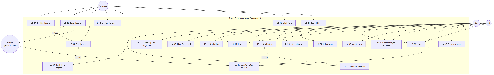

# B. Use Case Diagram & Tabel Skenario Sistem

## Sistem Pemesanan Menu Kafe Ponbean Coffee

---

## Use Case Diagram

---

## Tabel Skenario Sistem (Use Case Scenarios)

---

### UC-01: Scan QR Code

| Komponen | Deskripsi |
|----------|-----------|
| **Use Case ID** | UC-01 |
| **Nama** | Scan QR Code |
| **Aktor** | Pelanggan |
| **Deskripsi** | Pelanggan memindai QR Code yang tersedia di meja untuk mengakses menu digital |
| **Pre-condition** | QR Code tersedia di meja dan smartphone pelanggan memiliki kamera/scanner |
| **Post-condition** | Halaman menu digital terbuka di browser pelanggan dengan informasi meja terisi otomatis |

| **Skenario Utama (Main Flow)** |
|---|
| 1. Pelanggan membuka kamera atau aplikasi QR scanner di smartphone |
| 2. Pelanggan mengarahkan kamera ke QR Code di meja |
| 3. Sistem mendeteksi QR Code dan menerjemahkan URL |
| 4. Browser terbuka dan menampilkan halaman menu dengan `table_id` dari URL |
| 5. Sistem memuat daftar menu yang tersedia |

| **Skenario Alternatif** |
|---|
| 3a. QR Code rusak atau tidak terbaca → Pelanggan meminta bantuan ke kasir |
| 4a. Meja tidak aktif (`is_active = false`) → Sistem menampilkan pesan error |
| 4b. URL tidak valid → Sistem menampilkan halaman 404 |

---

### UC-02: Lihat Menu

| Komponen | Deskripsi |
|----------|-----------|
| **Use Case ID** | UC-02 |
| **Nama** | Lihat Menu |
| **Aktor** | Pelanggan |
| **Deskripsi** | Pelanggan melihat daftar menu yang tersedia beserta gambar, deskripsi, dan harga |
| **Pre-condition** | Pelanggan sudah mengakses halaman menu (melalui QR Code atau URL) |
| **Post-condition** | Pelanggan melihat daftar menu yang dikelompokkan berdasarkan kategori |

| **Skenario Utama (Main Flow)** |
|---|
| 1. Sistem menampilkan semua kategori menu |
| 2. Sistem menampilkan menu yang tersedia (`is_available = true`) |
| 3. Pelanggan memilih kategori untuk memfilter menu |
| 4. Sistem menampilkan menu sesuai kategori yang dipilih |
| 5. Pelanggan melihat detail menu (gambar, nama, deskripsi, harga) |

| **Skenario Alternatif** |
|---|
| 2a. Tidak ada menu tersedia → Sistem menampilkan pesan "Belum ada menu tersedia" |
| 3a. Pelanggan memilih "Semua" → Sistem menampilkan seluruh menu |

---

### UC-03: Tambah ke Keranjang

| Komponen | Deskripsi |
|----------|-----------|
| **Use Case ID** | UC-03 |
| **Nama** | Tambah ke Keranjang |
| **Aktor** | Pelanggan |
| **Deskripsi** | Pelanggan menambahkan item menu ke keranjang belanja |
| **Pre-condition** | Pelanggan sedang berada di halaman menu dan menu tersedia |
| **Post-condition** | Item menu ditambahkan ke keranjang dan badge jumlah item diperbarui |

| **Skenario Utama (Main Flow)** |
|---|
| 1. Pelanggan menekan tombol "Tambah" pada item menu |
| 2. Sistem memeriksa apakah item sudah ada di keranjang |
| 3. Jika item belum ada, sistem menambahkan item baru dengan quantity = 1 |
| 4. Sistem menampilkan notifikasi "Item ditambahkan ke keranjang" |
| 5. Badge jumlah item di keranjang diperbarui |

| **Skenario Alternatif** |
|---|
| 3a. Item sudah ada di keranjang → Sistem menambah quantity + 1 |

---

### UC-04: Kelola Keranjang

| Komponen | Deskripsi |
|----------|-----------|
| **Use Case ID** | UC-04 |
| **Nama** | Kelola Keranjang |
| **Aktor** | Pelanggan |
| **Deskripsi** | Pelanggan mengatur quantity, menambahkan catatan, atau menghapus item di keranjang |
| **Pre-condition** | Keranjang memiliki minimal 1 item |
| **Post-condition** | Keranjang diperbarui sesuai perubahan pelanggan |

| **Skenario Utama (Main Flow)** |
|---|
| 1. Pelanggan membuka panel keranjang (cart drawer) |
| 2. Sistem menampilkan daftar item di keranjang beserta subtotal |
| 3. Pelanggan mengubah quantity item (tombol +/-) |
| 4. Sistem menghitung ulang subtotal dan total harga |
| 5. Pelanggan menambahkan catatan khusus untuk item tertentu |
| 6. Sistem menyimpan catatan pada item |

| **Skenario Alternatif** |
|---|
| 3a. Quantity dikurangi menjadi 0 → Sistem menghapus item dari keranjang |
| 3b. Pelanggan menekan tombol hapus → Sistem menghapus item dari keranjang |
| 6a. Keranjang kosong → Sistem menampilkan pesan "Keranjang kosong" |

---

### UC-05: Buat Pesanan

| Komponen | Deskripsi |
|----------|-----------|
| **Use Case ID** | UC-05 |
| **Nama** | Buat Pesanan |
| **Aktor** | Pelanggan |
| **Deskripsi** | Pelanggan mengirimkan pesanan dari keranjang ke sistem |
| **Pre-condition** | Keranjang memiliki minimal 1 item dan meja valid |
| **Post-condition** | Pesanan tersimpan di database dengan status "pending_payment" dan kasir menerima notifikasi |

| **Skenario Utama (Main Flow)** |
|---|
| 1. Pelanggan mengisi nama (opsional) |
| 2. Pelanggan menekan tombol "Buat Pesanan" |
| 3. Sistem memvalidasi: meja aktif, semua item tersedia |
| 4. Sistem menghitung total harga pesanan |
| 5. Sistem men-generate nomor pesanan (format: ORD-YYYYMMDD-XXX) |
| 6. Sistem menyimpan Order dan OrderItem ke database |
| 7. Sistem mengirim event "new_order" via Socket.io ke dashboard kasir |
| 8. Sistem menampilkan halaman pembayaran |
| 9. Keranjang dikosongkan |

| **Skenario Alternatif** |
|---|
| 3a. Meja tidak aktif → Sistem menampilkan error "Meja tidak valid atau tidak aktif" |
| 3b. Salah satu menu tidak tersedia → Sistem menampilkan error dengan nama menu |
| 3c. Meja tidak ditemukan → Sistem menampilkan error |

---

### UC-06: Bayar Pesanan

| Komponen | Deskripsi |
|----------|-----------|
| **Use Case ID** | UC-06 |
| **Nama** | Bayar Pesanan |
| **Aktor** | Pelanggan, Midtrans (Payment Gateway) |
| **Deskripsi** | Pelanggan melakukan pembayaran pesanan melalui Midtrans |
| **Pre-condition** | Pesanan sudah dibuat dengan status "pending_payment" |
| **Post-condition** | Pembayaran berhasil dan status pesanan berubah menjadi "paid" |

| **Skenario Utama (Main Flow)** |
|---|
| 1. Sistem mengirim parameter transaksi ke Midtrans Snap API |
| 2. Midtrans mengembalikan snap_token dan redirect_url |
| 3. Sistem menampilkan halaman pembayaran Midtrans (Snap popup) |
| 4. Pelanggan memilih metode pembayaran (QRIS, VA, e-Wallet, Kartu Kredit) |
| 5. Pelanggan menyelesaikan pembayaran |
| 6. Midtrans mengirim notifikasi webhook ke server |
| 7. Server memverifikasi notifikasi dan mengubah status pesanan menjadi "paid" |
| 8. Server mengirim event "order_updated" via Socket.io |
| 9. Pelanggan diarahkan ke halaman tracking pesanan |

| **Skenario Alternatif** |
|---|
| 4a. Pelanggan membatalkan pembayaran → Status tetap "pending_payment" |
| 5a. Pembayaran gagal → Midtrans mengirim status "deny" → Status menjadi "cancelled" |
| 5b. Pembayaran expired → Midtrans mengirim status "expire" → Status menjadi "cancelled" |
| 6a. Webhook gagal → Sistem bisa cek manual via API status Midtrans |

---

### UC-07: Tracking Pesanan

| Komponen | Deskripsi |
|----------|-----------|
| **Use Case ID** | UC-07 |
| **Nama** | Tracking Pesanan |
| **Aktor** | Pelanggan |
| **Deskripsi** | Pelanggan memantau status pesanan secara real-time |
| **Pre-condition** | Pesanan sudah dibuat dan pelanggan memiliki nomor pesanan |
| **Post-condition** | Pelanggan mengetahui status terbaru pesanan |

| **Skenario Utama (Main Flow)** |
|---|
| 1. Pelanggan mengakses halaman tracking (via redirect atau URL langsung) |
| 2. Sistem mengambil data pesanan berdasarkan order_number |
| 3. Sistem menampilkan detail pesanan dan status saat ini |
| 4. Sistem mendengarkan event "order_updated" via Socket.io |
| 5. Ketika status berubah, tampilan diperbarui secara otomatis (real-time) |

| **Skenario Alternatif** |
|---|
| 2a. Nomor pesanan tidak valid → Sistem menampilkan "Pesanan tidak ditemukan" |

---

### UC-08: Login

| Komponen | Deskripsi |
|----------|-----------|
| **Use Case ID** | UC-08 |
| **Nama** | Login |
| **Aktor** | Admin, Kasir |
| **Deskripsi** | Admin/Kasir melakukan login untuk mengakses dashboard |
| **Pre-condition** | User memiliki akun yang valid (admin/kasir) |
| **Post-condition** | User terotentikasi dan diarahkan ke dashboard sesuai role |

| **Skenario Utama (Main Flow)** |
|---|
| 1. User mengakses halaman login |
| 2. User memasukkan username dan password |
| 3. Sistem memvalidasi kredensial |
| 4. Sistem men-generate token JWT |
| 5. Token dan data user disimpan di localStorage |
| 6. Jika role = "admin" → Diarahkan ke /admin |
| 7. Jika role = "kasir" → Diarahkan ke /kasir |

| **Skenario Alternatif** |
|---|
| 2a. Username atau password kosong → Sistem menampilkan error validasi |
| 3a. Username tidak ditemukan → Sistem menampilkan "Username atau password salah" |
| 3b. Password salah → Sistem menampilkan "Username atau password salah" |

---

### UC-09: Kelola Menu (CRUD)

| Komponen | Deskripsi |
|----------|-----------|
| **Use Case ID** | UC-09 |
| **Nama** | Kelola Menu |
| **Aktor** | Admin |
| **Deskripsi** | Admin menambah, melihat, mengubah, dan menghapus item menu |
| **Pre-condition** | Admin sudah login dan berada di halaman Menu Management |
| **Post-condition** | Data menu diperbarui di database |

| **Skenario Utama (Main Flow) — Tambah Menu** |
|---|
| 1. Admin menekan tombol "Tambah Menu" |
| 2. Sistem menampilkan form input (nama, kategori, harga, deskripsi, gambar) |
| 3. Admin mengisi form dan mengupload gambar |
| 4. Sistem memvalidasi input (nama, kategori, harga wajib diisi) |
| 5. Sistem menyimpan data menu ke database |
| 6. Sistem menyimpan file gambar ke folder uploads |
| 7. Sistem menampilkan notifikasi "Menu berhasil ditambahkan" |

| **Skenario Alternatif — Edit Menu** |
|---|
| 1. Admin menekan tombol "Edit" pada item menu |
| 2. Sistem menampilkan form yang terisi data menu saat ini |
| 3. Admin mengubah data yang diinginkan |
| 4. Jika gambar diubah, sistem menghapus gambar lama dan menyimpan yang baru |
| 5. Sistem menyimpan perubahan dan menampilkan notifikasi |

| **Skenario Alternatif — Hapus Menu** |
|---|
| 1. Admin menekan tombol "Hapus" pada item menu |
| 2. Sistem menampilkan konfirmasi penghapusan |
| 3. Admin mengkonfirmasi → Sistem menghapus menu dan file gambar terkait |

| **Skenario Alternatif — Toggle Ketersediaan** |
|---|
| 1. Admin menekan toggle ketersediaan menu |
| 2. Sistem mengubah `is_available` (true ↔ false) |
| 3. Menu yang tidak tersedia tidak muncul di halaman pelanggan |

---

### UC-10: Kelola Kategori

| Komponen | Deskripsi |
|----------|-----------|
| **Use Case ID** | UC-10 |
| **Nama** | Kelola Kategori |
| **Aktor** | Admin |
| **Deskripsi** | Admin menambah, mengubah, dan menghapus kategori menu |
| **Pre-condition** | Admin sudah login |
| **Post-condition** | Data kategori diperbarui di database |

| **Skenario Utama (Main Flow)** |
|---|
| 1. Admin mengakses halaman kelola kategori |
| 2. Sistem menampilkan daftar kategori beserta jumlah menu per kategori |
| 3. Admin menambah kategori baru (nama, icon) |
| 4. Sistem menyimpan kategori ke database |

| **Skenario Alternatif — Hapus Kategori** |
|---|
| 3a. Admin menghapus kategori yang masih memiliki menu → Sistem menampilkan error "Kategori tidak bisa dihapus karena masih memiliki menu" |
| 3b. Admin menghapus kategori kosong → Sistem menghapus dan menampilkan notifikasi sukses |

---

### UC-11: Kelola Meja

| Komponen | Deskripsi |
|----------|-----------|
| **Use Case ID** | UC-11 |
| **Nama** | Kelola Meja |
| **Aktor** | Admin |
| **Deskripsi** | Admin menambah, menghapus, dan mengatur status meja serta QR Code |
| **Pre-condition** | Admin sudah login dan berada di halaman Table Management |
| **Post-condition** | Data meja dan QR Code diperbarui |

| **Skenario Utama (Main Flow) — Tambah Meja** |
|---|
| 1. Admin memasukkan nomor meja |
| 2. Sistem memvalidasi nomor meja (tidak boleh duplikat) |
| 3. Sistem menyimpan data meja ke database |
| 4. Sistem otomatis men-generate QR Code (file PNG) yang mengarah ke URL menu |
| 5. Sistem menampilkan meja baru beserta QR Code-nya |

| **Skenario Alternatif** |
|---|
| 2a. Nomor meja sudah ada → Sistem menampilkan error "Nomor meja sudah ada" |
| Alt: Admin menghapus meja → Sistem menghapus data meja dan file QR Code |
| Alt: Admin toggle status meja → Sistem mengubah `is_active` (aktif/nonaktif) |
| Alt: Admin regenerate QR → Sistem menghapus QR lama dan membuat QR baru |

---

### UC-12: Kelola User

| Komponen | Deskripsi |
|----------|-----------|
| **Use Case ID** | UC-12 |
| **Nama** | Kelola User |
| **Aktor** | Admin |
| **Deskripsi** | Admin menambah dan menghapus akun admin atau kasir |
| **Pre-condition** | Admin sudah login |
| **Post-condition** | Data user diperbarui di database |

| **Skenario Utama (Main Flow) — Tambah User** |
|---|
| 1. Admin mengisi form (nama, username, password, role) |
| 2. Sistem memvalidasi input (nama, username, password wajib) |
| 3. Sistem memeriksa username belum terpakai |
| 4. Sistem meng-hash password dengan bcrypt |
| 5. Sistem menyimpan user baru |

| **Skenario Alternatif** |
|---|
| 3a. Username sudah digunakan → Sistem menampilkan error |
| Alt: Admin menghapus user lain → Sistem menghapus user dari database |
| Alt: Admin menghapus akun sendiri → Sistem menolak "Tidak bisa menghapus akun sendiri" |

---

### UC-13: Lihat Dashboard

| Komponen | Deskripsi |
|----------|-----------|
| **Use Case ID** | UC-13 |
| **Nama** | Lihat Dashboard |
| **Aktor** | Admin |
| **Deskripsi** | Admin melihat ringkasan statistik penjualan di dashboard |
| **Pre-condition** | Admin sudah login |
| **Post-condition** | Dashboard menampilkan statistik terkini |

| **Skenario Utama (Main Flow)** |
|---|
| 1. Sistem mengambil data statistik dari API |
| 2. Sistem menampilkan ringkasan: total pesanan, total pendapatan, rata-rata per pesanan |
| 3. Sistem menampilkan daftar menu terlaris |
| 4. Sistem menampilkan pesanan terbaru |

---

### UC-14: Lihat Laporan Penjualan

| Komponen | Deskripsi |
|----------|-----------|
| **Use Case ID** | UC-14 |
| **Nama** | Lihat Laporan Penjualan |
| **Aktor** | Admin |
| **Deskripsi** | Admin melihat rekap penjualan berdasarkan rentang tanggal |
| **Pre-condition** | Admin sudah login dan ada data pesanan |
| **Post-condition** | Laporan ditampilkan sesuai filter |

| **Skenario Utama (Main Flow)** |
|---|
| 1. Admin memilih rentang tanggal (start_date, end_date) |
| 2. Sistem mengambil data pesanan yang statusnya paid/processing/completed dalam rentang tersebut |
| 3. Sistem menghitung total pendapatan, jumlah pesanan, rata-rata per pesanan |
| 4. Sistem menampilkan 10 menu terlaris |
| 5. Sistem menampilkan daftar detail pesanan |

| **Skenario Alternatif** |
|---|
| 2a. Tidak ada pesanan dalam rentang tanggal → Sistem menampilkan data kosong (total = 0) |

---

### UC-15: Terima Pesanan

| Komponen | Deskripsi |
|----------|-----------|
| **Use Case ID** | UC-15 |
| **Nama** | Terima Pesanan |
| **Aktor** | Kasir |
| **Deskripsi** | Kasir menerima pesanan baru secara real-time |
| **Pre-condition** | Kasir sudah login dan terhubung via Socket.io |
| **Post-condition** | Pesanan baru tampil di dashboard kasir |

| **Skenario Utama (Main Flow)** |
|---|
| 1. Pelanggan membuat pesanan baru |
| 2. Server mengirim event "new_order" via Socket.io |
| 3. Dashboard kasir menerima event dan menampilkan notifikasi |
| 4. Pesanan baru muncul di daftar pesanan masuk |
| 5. Kasir melihat detail pesanan (nomor meja, item, total) |

---

### UC-16: Update Status Pesanan

| Komponen | Deskripsi |
|----------|-----------|
| **Use Case ID** | UC-16 |
| **Nama** | Update Status Pesanan |
| **Aktor** | Kasir, Midtrans |
| **Deskripsi** | Kasir mengubah status pesanan sesuai progres atau Midtrans mengupdate via webhook |
| **Pre-condition** | Pesanan sudah ada di sistem |
| **Post-condition** | Status pesanan diperbarui dan pelanggan mendapat update real-time |

| **Skenario Utama (Main Flow)** |
|---|
| 1. Kasir memilih pesanan dari daftar |
| 2. Kasir memilih status baru |
| 3. Alur status: `pending_payment` → `paid` → `processing` → `completed` |
| 4. Sistem menyimpan status baru ke database |
| 5. Sistem mengirim event "order_updated" via Socket.io |
| 6. Halaman tracking pelanggan diperbarui secara real-time |

| **Skenario Alternatif** |
|---|
| 2a. Status "cancelled" → Pesanan dibatalkan |
| Alt: Midtrans mengirim webhook → Server otomatis update status berdasarkan transaction_status |

---

### UC-17: Lihat Riwayat Pesanan

| Komponen | Deskripsi |
|----------|-----------|
| **Use Case ID** | UC-17 |
| **Nama** | Lihat Riwayat Pesanan |
| **Aktor** | Kasir |
| **Deskripsi** | Kasir melihat histori semua pesanan |
| **Pre-condition** | Kasir sudah login |
| **Post-condition** | Daftar riwayat pesanan ditampilkan |

| **Skenario Utama (Main Flow)** |
|---|
| 1. Kasir membuka halaman riwayat pesanan |
| 2. Sistem mengambil semua pesanan diurutkan dari terbaru |
| 3. Kasir dapat memfilter berdasarkan status atau tanggal |
| 4. Kasir dapat melihat detail pesanan tertentu |

---

### UC-18: Cetak Struk

| Komponen | Deskripsi |
|----------|-----------|
| **Use Case ID** | UC-18 |
| **Nama** | Cetak Struk |
| **Aktor** | Kasir |
| **Deskripsi** | Kasir mencetak struk pesanan |
| **Pre-condition** | Pesanan sudah dibayar (status ≥ "paid") |
| **Post-condition** | Struk dicetak ke printer thermal 80mm |

| **Skenario Utama (Main Flow)** |
|---|
| 1. Kasir memilih pesanan dan menekan tombol "Cetak Struk" |
| 2. Sistem men-generate format struk (nomor pesanan, meja, item, total, waktu) |
| 3. Sistem mengirim data ke printer thermal |
| 4. Struk tercetak |

---

### UC-19: Logout

| Komponen | Deskripsi |
|----------|-----------|
| **Use Case ID** | UC-19 |
| **Nama** | Logout |
| **Aktor** | Admin, Kasir |
| **Deskripsi** | User keluar dari sistem |
| **Pre-condition** | User sudah login |
| **Post-condition** | Token dan data user dihapus, user diarahkan ke halaman login |

| **Skenario Utama (Main Flow)** |
|---|
| 1. User menekan tombol "Logout" |
| 2. Sistem menghapus token JWT dan data user dari localStorage |
| 3. Sistem mengarahkan user ke halaman login |

---

### UC-20: Generate QR Code

| Komponen | Deskripsi |
|----------|-----------|
| **Use Case ID** | UC-20 |
| **Nama** | Generate QR Code |
| **Aktor** | Admin |
| **Deskripsi** | Sistem men-generate QR Code untuk meja yang mengarah ke URL menu |
| **Pre-condition** | Meja sudah dibuat di sistem |
| **Post-condition** | File QR Code (PNG) tersimpan di server |

| **Skenario Utama (Main Flow)** |
|---|
| 1. Sistem membuat URL menu: `{CLIENT_URL}/menu/{table_id}` |
| 2. Sistem men-generate QR Code PNG dengan error correction level "H" |
| 3. Sistem menyimpan file ke folder `uploads/qrcodes/` |
| 4. Sistem mengupdate kolom `qr_code` pada tabel meja |

| **Skenario Alternatif** |
|---|
| Alt: Admin memilih "Regenerate All QR" → Sistem men-generate ulang QR untuk semua meja aktif |
