# C. Activity Diagram

## Sistem Pemesanan Menu Kafe Ponbean Coffee

---

## 1. Activity Diagram — UC-01: Scan QR Code

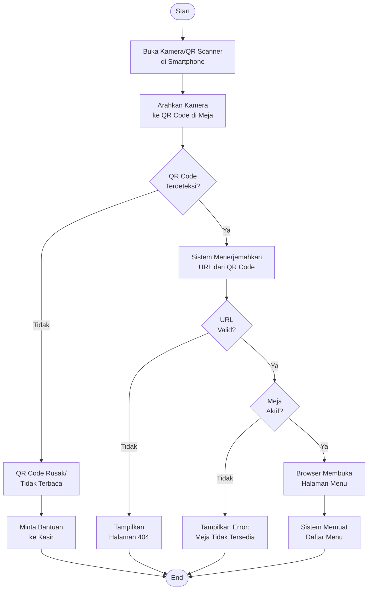
```mermaid
flowchart TD
    Start([Start]) --> BukaKamera["Buka Kamera/QR Scanner\ndi Smartphone"]
    BukaKamera --> ArahkanQR["Arahkan Kamera\nke QR Code di Meja"]
    ArahkanQR --> DeteksiQR{"QR Code\nTerdeteksi?"}

    DeteksiQR -->|Tidak| QRRusak["QR Code Rusak/\nTidak Terbaca"]
    QRRusak --> MintaBantuan["Minta Bantuan\nke Kasir"]
    MintaBantuan --> End([End])

    DeteksiQR -->|Ya| TerjemahkanURL["Sistem Menerjemahkan\nURL dari QR Code"]
    TerjemahkanURL --> ValidasiURL{"URL\nValid?"}

    ValidasiURL -->|Tidak| Halaman404["Tampilkan\nHalaman 404"]
    Halaman404 --> End

    ValidasiURL -->|Ya| CekMeja{"Meja\nAktif?"}

    CekMeja -->|Tidak| ErrorMeja["Tampilkan Error:\nMeja Tidak Tersedia"]
    ErrorMeja --> End

    CekMeja -->|Ya| BukaMenu["Browser Membuka\nHalaman Menu"]
    BukaMenu --> MuatMenu["Sistem Memuat\nDaftar Menu"]
    MuatMenu --> End
```

---

## 2. Activity Diagram — UC-02: Tambah ke Keranjang

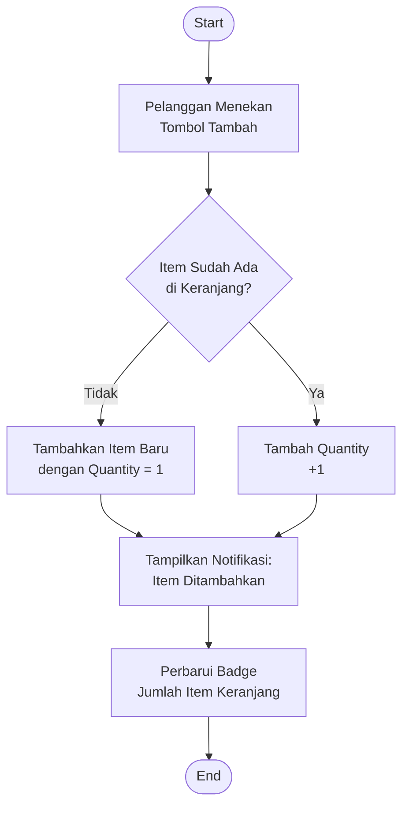
```mermaid
flowchart TD
    Start([Start]) --> TekanTambah["Pelanggan Menekan\nTombol Tambah"]
    TekanTambah --> CekKeranjang{"Item Sudah Ada\ndi Keranjang?"}

    CekKeranjang -->|Tidak| TambahBaru["Tambahkan Item Baru\ndengan Quantity = 1"]
    CekKeranjang -->|Ya| TambahQty["Tambah Quantity\n+1"]

    TambahBaru --> Notifikasi["Tampilkan Notifikasi:\nItem Ditambahkan"]
    TambahQty --> Notifikasi

    Notifikasi --> UpdateBadge["Perbarui Badge\nJumlah Item Keranjang"]
    UpdateBadge --> End([End])
```

---

## 3. Activity Diagram — UC-03: Kelola Keranjang

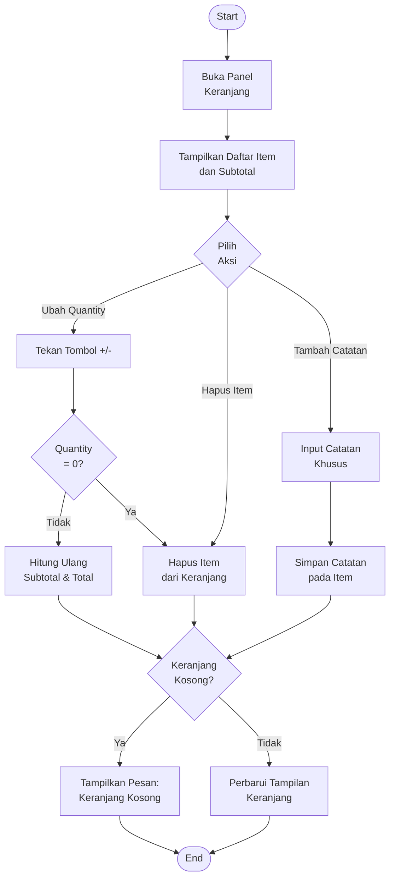
```mermaid
flowchart TD
    Start([Start]) --> BukaCart["Buka Panel\nKeranjang"]
    BukaCart --> TampilItem["Tampilkan Daftar Item\ndan Subtotal"]
    TampilItem --> PilihAksi{"Pilih\nAksi"}

    PilihAksi -->|Ubah Quantity| UbahQty["Tekan Tombol +/-"]
    UbahQty --> CekQty{"Quantity\n= 0?"}
    CekQty -->|Ya| HapusItem["Hapus Item\ndari Keranjang"]
    CekQty -->|Tidak| HitungUlang["Hitung Ulang\nSubtotal & Total"]
    HitungUlang --> CekKosong{"Keranjang\nKosong?"}

    PilihAksi -->|Hapus Item| HapusItem
    HapusItem --> CekKosong

    PilihAksi -->|Tambah Catatan| InputCatatan["Input Catatan\nKhusus"]
    InputCatatan --> SimpanCatatan["Simpan Catatan\npada Item"]
    SimpanCatatan --> CekKosong

    CekKosong -->|Ya| PesanKosong["Tampilkan Pesan:\nKeranjang Kosong"]
    PesanKosong --> End([End])
    CekKosong -->|Tidak| TampilItem2["Perbarui Tampilan\nKeranjang"]
    TampilItem2 --> End
```

---

## 4. Activity Diagram — UC-04: Buat Pesanan

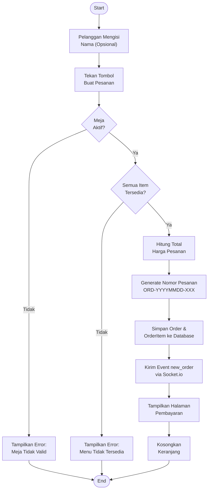
```mermaid
flowchart TD
    Start([Start]) --> IsiNama["Pelanggan Mengisi\nNama (Opsional)"]
    IsiNama --> TekanPesan["Tekan Tombol\nBuat Pesanan"]
    TekanPesan --> ValidasiMeja{"Meja\nAktif?"}

    ValidasiMeja -->|Tidak| ErrorMeja["Tampilkan Error:\nMeja Tidak Valid"]
    ErrorMeja --> End([End])

    ValidasiMeja -->|Ya| ValidasiItem{"Semua Item\nTersedia?"}

    ValidasiItem -->|Tidak| ErrorItem["Tampilkan Error:\nMenu Tidak Tersedia"]
    ErrorItem --> End

    ValidasiItem -->|Ya| HitungTotal["Hitung Total\nHarga Pesanan"]
    HitungTotal --> GenerateNomor["Generate Nomor Pesanan\nORD-YYYYMMDD-XXX"]
    GenerateNomor --> SimpanDB["Simpan Order &\nOrderItem ke Database"]
    SimpanDB --> KirimSocket["Kirim Event new_order\nvia Socket.io"]
    KirimSocket --> TampilBayar["Tampilkan Halaman\nPembayaran"]
    TampilBayar --> KosongkanCart["Kosongkan\nKeranjang"]
    KosongkanCart --> End
```

---

## 5. Activity Diagram — UC-05: Bayar Pesanan

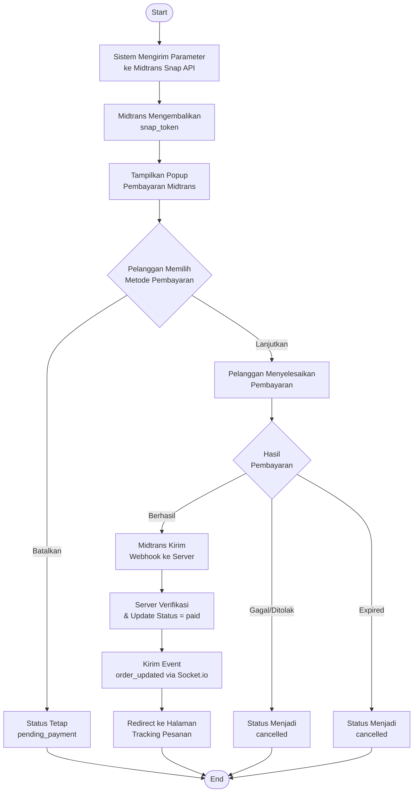
```mermaid
flowchart TD
    Start([Start]) --> KirimParam["Sistem Mengirim Parameter\nke Midtrans Snap API"]
    KirimParam --> TerimaToken["Midtrans Mengembalikan\nsnap_token"]
    TerimaToken --> TampilSnap["Tampilkan Popup\nPembayaran Midtrans"]
    TampilSnap --> PilihMetode{"Pelanggan Memilih\nMetode Pembayaran"}

    PilihMetode -->|Batalkan| BatalBayar["Status Tetap\npending_payment"]
    BatalBayar --> End([End])

    PilihMetode -->|Lanjutkan| ProsesBayar["Pelanggan Menyelesaikan\nPembayaran"]
    ProsesBayar --> HasilBayar{"Hasil\nPembayaran"}

    HasilBayar -->|Berhasil| Webhook["Midtrans Kirim\nWebhook ke Server"]
    Webhook --> VerifikasiServer["Server Verifikasi\n& Update Status = paid"]
    VerifikasiServer --> KirimUpdate["Kirim Event\norder_updated via Socket.io"]
    KirimUpdate --> HalamanTracking["Redirect ke Halaman\nTracking Pesanan"]
    HalamanTracking --> End

    HasilBayar -->|Gagal/Ditolak| StatusDeny["Status Menjadi\ncancelled"]
    StatusDeny --> End

    HasilBayar -->|Expired| StatusExpire["Status Menjadi\ncancelled"]
    StatusExpire --> End
```

---

## 6. Activity Diagram — UC-06: Tracking Pesanan

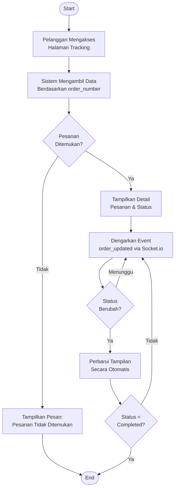
```mermaid
flowchart TD
    Start([Start]) --> AksesTracking["Pelanggan Mengakses\nHalaman Tracking"]
    AksesTracking --> AmbilData["Sistem Mengambil Data\nBerdasarkan order_number"]
    AmbilData --> ValidasiPesanan{"Pesanan\nDitemukan?"}

    ValidasiPesanan -->|Tidak| ErrorNotFound["Tampilkan Pesan:\nPesanan Tidak Ditemukan"]
    ErrorNotFound --> End([End])

    ValidasiPesanan -->|Ya| TampilDetail["Tampilkan Detail\nPesanan & Status"]
    TampilDetail --> ListenSocket["Dengarkan Event\norder_updated via Socket.io"]
    ListenSocket --> TungguUpdate{"Status\nBerubah?"}

    TungguUpdate -->|Ya| UpdateTampilan["Perbarui Tampilan\nSecara Otomatis"]
    UpdateTampilan --> CekSelesai{"Status =\nCompleted?"}
    CekSelesai -->|Tidak| ListenSocket
    CekSelesai -->|Ya| End

    TungguUpdate -->|Menunggu| ListenSocket
```

---

## 7. Activity Diagram — UC-07: Login

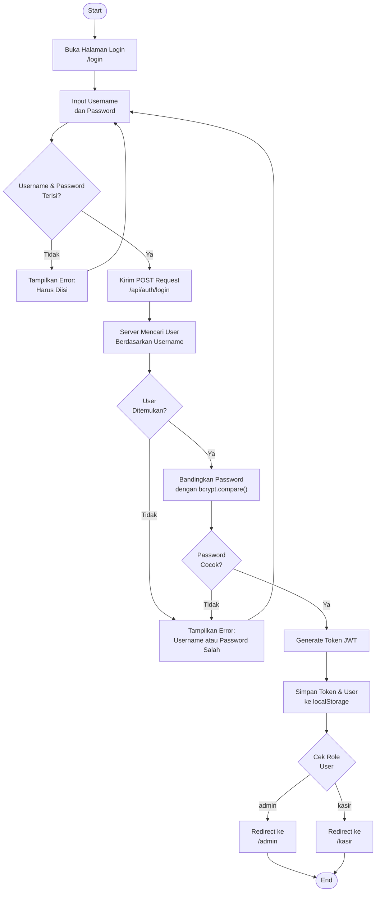
```mermaid
flowchart TD
    Start([Start]) --> BukaLogin["Buka Halaman Login\n/login"]
    BukaLogin --> InputCredential["Input Username\ndan Password"]
    InputCredential --> ValidasiInput{"Username & Password\nTerisi?"}

    ValidasiInput -->|Tidak| ErrorInput["Tampilkan Error:\nHarus Diisi"]
    ErrorInput --> InputCredential

    ValidasiInput -->|Ya| KirimRequest["Kirim POST Request\n/api/auth/login"]
    KirimRequest --> CariUser["Server Mencari User\nBerdasarkan Username"]
    CariUser --> UserAda{"User\nDitemukan?"}

    UserAda -->|Tidak| ErrorLogin["Tampilkan Error:\nUsername atau Password Salah"]
    ErrorLogin --> InputCredential

    UserAda -->|Ya| ComparePassword["Bandingkan Password\ndengan bcrypt.compare()"]
    ComparePassword --> PasswordCocok{"Password\nCocok?"}

    PasswordCocok -->|Tidak| ErrorLogin
    PasswordCocok -->|Ya| GenerateJWT["Generate Token JWT"]

    GenerateJWT --> SimpanToken["Simpan Token & User\nke localStorage"]
    SimpanToken --> CekRole{"Cek Role\nUser"}

    CekRole -->|admin| RedirectAdmin["Redirect ke\n/admin"]
    CekRole -->|kasir| RedirectKasir["Redirect ke\n/kasir"]

    RedirectAdmin --> End([End])
    RedirectKasir --> End
```

---

## 8. Activity Diagram — UC-08: Kelola Menu (CRUD)

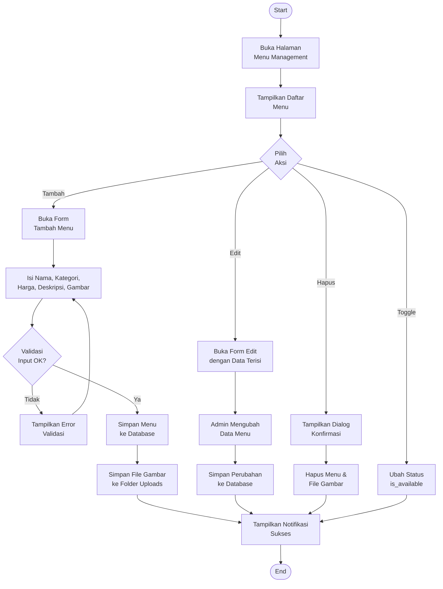
```mermaid
flowchart TD
    Start([Start]) --> BukaMenu["Buka Halaman\nMenu Management"]
    BukaMenu --> TampilDaftar["Tampilkan Daftar\nMenu"]
    TampilDaftar --> PilihAksi{"Pilih\nAksi"}

    PilihAksi -->|Tambah| FormTambah["Buka Form\nTambah Menu"]
    FormTambah --> IsiForm["Isi Nama, Kategori,\nHarga, Deskripsi, Gambar"]
    IsiForm --> ValidasiInput{"Validasi\nInput OK?"}
    ValidasiInput -->|Tidak| ErrorValidasi["Tampilkan Error\nValidasi"]
    ErrorValidasi --> IsiForm
    ValidasiInput -->|Ya| SimpanMenu["Simpan Menu\nke Database"]
    SimpanMenu --> UploadGambar["Simpan File Gambar\nke Folder Uploads"]
    UploadGambar --> NotifSukses["Tampilkan Notifikasi\nSukses"]

    PilihAksi -->|Edit| FormEdit["Buka Form Edit\ndengan Data Terisi"]
    FormEdit --> UbahData["Admin Mengubah\nData Menu"]
    UbahData --> SimpanPerubahan["Simpan Perubahan\nke Database"]
    SimpanPerubahan --> NotifSukses

    PilihAksi -->|Hapus| KonfirmasiHapus["Tampilkan Dialog\nKonfirmasi"]
    KonfirmasiHapus --> HapusMenu["Hapus Menu &\nFile Gambar"]
    HapusMenu --> NotifSukses

    PilihAksi -->|Toggle| ToggleStatus["Ubah Status\nis_available"]
    ToggleStatus --> NotifSukses

    NotifSukses --> End([End])
```

---

## 9. Activity Diagram — UC-09: Kelola Kategori

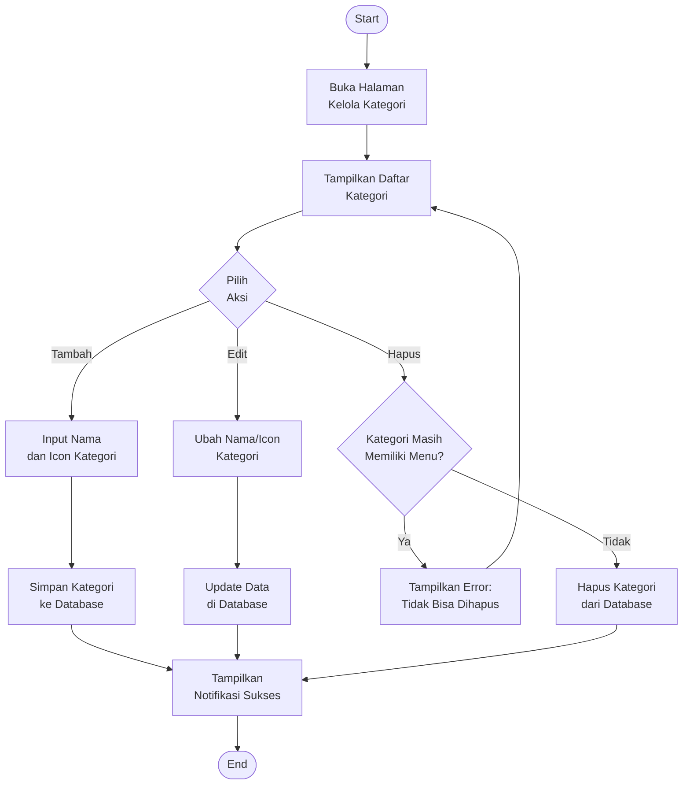
```mermaid
flowchart TD
    Start([Start]) --> BukaKategori["Buka Halaman\nKelola Kategori"]
    BukaKategori --> TampilDaftar["Tampilkan Daftar\nKategori"]
    TampilDaftar --> PilihAksi{"Pilih\nAksi"}

    PilihAksi -->|Tambah| InputKategori["Input Nama\ndan Icon Kategori"]
    InputKategori --> SimpanKategori["Simpan Kategori\nke Database"]
    SimpanKategori --> NotifSukses["Tampilkan\nNotifikasi Sukses"]

    PilihAksi -->|Edit| EditKategori["Ubah Nama/Icon\nKategori"]
    EditKategori --> UpdateKategori["Update Data\ndi Database"]
    UpdateKategori --> NotifSukses

    PilihAksi -->|Hapus| CekMenu{"Kategori Masih\nMemiliki Menu?"}
    CekMenu -->|Ya| ErrorHapus["Tampilkan Error:\nTidak Bisa Dihapus"]
    ErrorHapus --> TampilDaftar
    CekMenu -->|Tidak| HapusKategori["Hapus Kategori\ndari Database"]
    HapusKategori --> NotifSukses

    NotifSukses --> End([End])
```

---

## 10. Activity Diagram — UC-10: Kelola Meja

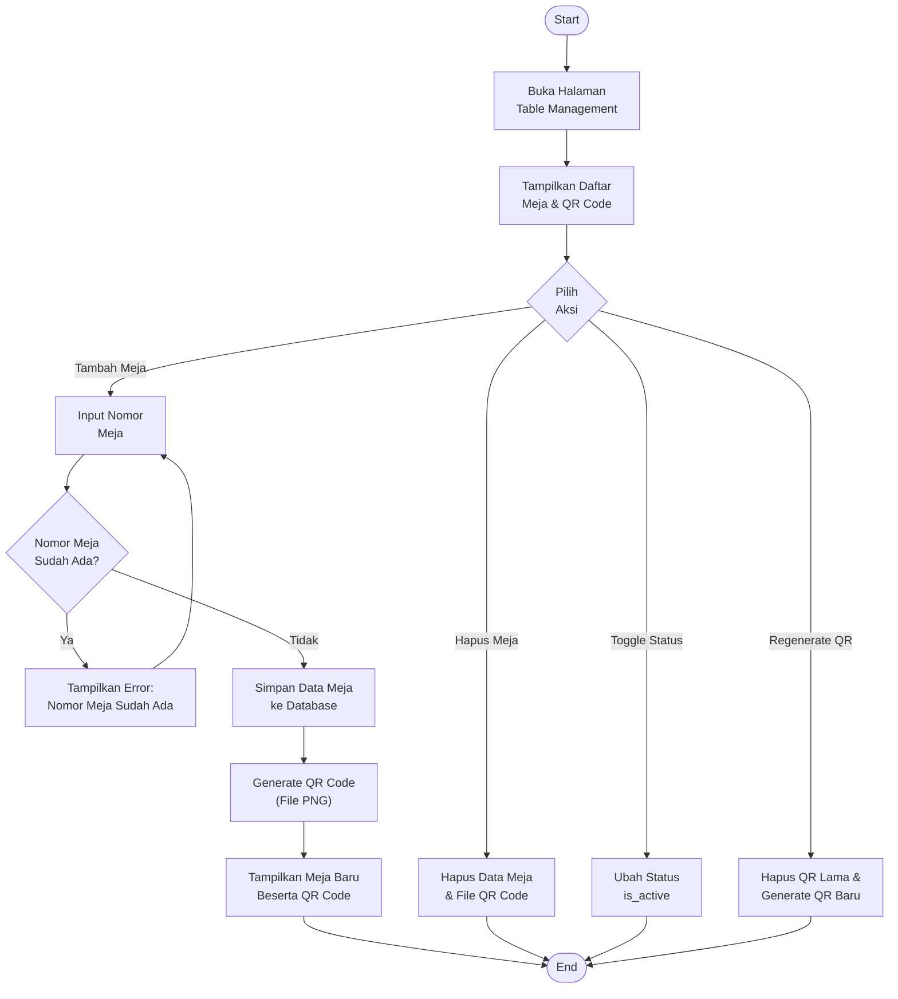
```mermaid
flowchart TD
    Start([Start]) --> BukaMeja["Buka Halaman\nTable Management"]
    BukaMeja --> TampilDaftar["Tampilkan Daftar\nMeja & QR Code"]
    TampilDaftar --> PilihAksi{"Pilih\nAksi"}

    PilihAksi -->|Tambah Meja| InputNomor["Input Nomor\nMeja"]
    InputNomor --> CekDuplikat{"Nomor Meja\nSudah Ada?"}
    CekDuplikat -->|Ya| ErrorDuplikat["Tampilkan Error:\nNomor Meja Sudah Ada"]
    ErrorDuplikat --> InputNomor
    CekDuplikat -->|Tidak| SimpanMeja["Simpan Data Meja\nke Database"]
    SimpanMeja --> GenerateQR["Generate QR Code\n(File PNG)"]
    GenerateQR --> TampilMeja["Tampilkan Meja Baru\nBeserta QR Code"]
    TampilMeja --> End([End])

    PilihAksi -->|Hapus Meja| HapusMeja["Hapus Data Meja\n& File QR Code"]
    HapusMeja --> End

    PilihAksi -->|Toggle Status| ToggleAktif["Ubah Status\nis_active"]
    ToggleAktif --> End

    PilihAksi -->|Regenerate QR| RegenQR["Hapus QR Lama &\nGenerate QR Baru"]
    RegenQR --> End
```

---

## 11. Activity Diagram — UC-11: Kelola User

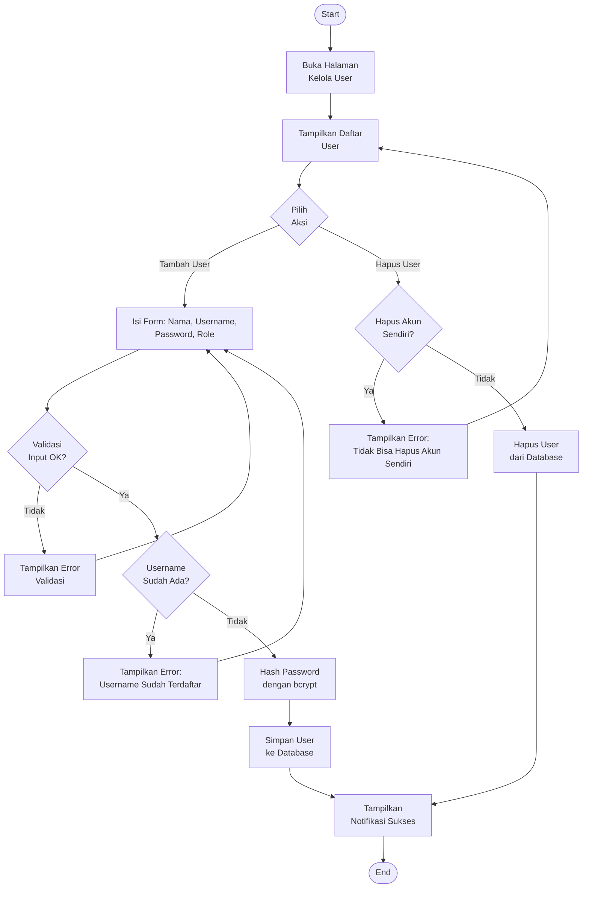
```mermaid
flowchart TD
    Start([Start]) --> BukaUser["Buka Halaman\nKelola User"]
    BukaUser --> TampilDaftar["Tampilkan Daftar\nUser"]
    TampilDaftar --> PilihAksi{"Pilih\nAksi"}

    PilihAksi -->|Tambah User| IsiForm["Isi Form: Nama, Username,\nPassword, Role"]
    IsiForm --> ValidasiInput{"Validasi\nInput OK?"}
    ValidasiInput -->|Tidak| ErrorValidasi["Tampilkan Error\nValidasi"]
    ErrorValidasi --> IsiForm
    ValidasiInput -->|Ya| CekUsername{"Username\nSudah Ada?"}
    CekUsername -->|Ya| ErrorUsername["Tampilkan Error:\nUsername Sudah Terdaftar"]
    ErrorUsername --> IsiForm
    CekUsername -->|Tidak| HashPassword["Hash Password\ndengan bcrypt"]
    HashPassword --> SimpanUser["Simpan User\nke Database"]
    SimpanUser --> NotifSukses["Tampilkan\nNotifikasi Sukses"]
    NotifSukses --> End([End])

    PilihAksi -->|Hapus User| CekDiri{"Hapus Akun\nSendiri?"}
    CekDiri -->|Ya| ErrorDiri["Tampilkan Error:\nTidak Bisa Hapus Akun Sendiri"]
    ErrorDiri --> TampilDaftar
    CekDiri -->|Tidak| HapusUser["Hapus User\ndari Database"]
    HapusUser --> NotifSukses
```

---

## 12. Activity Diagram — UC-12: Lihat Dashboard

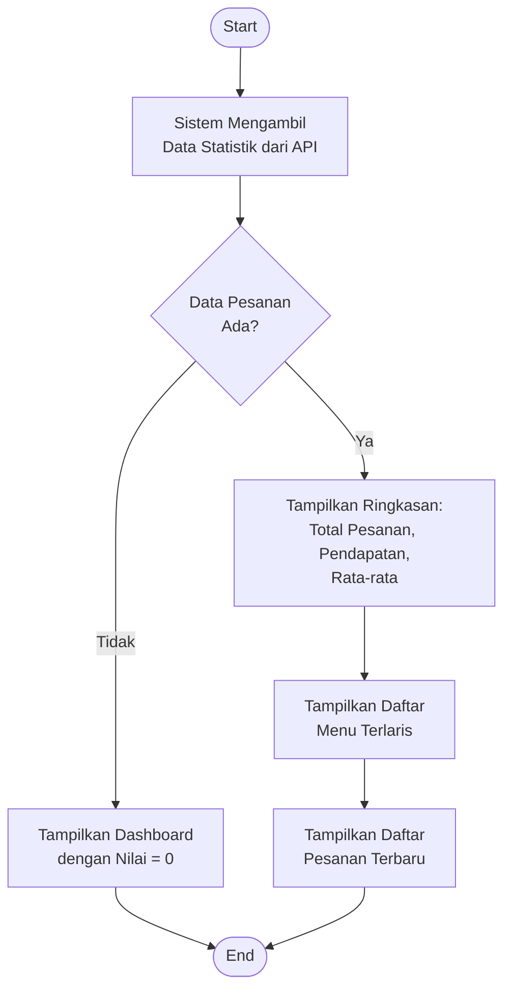
```mermaid
flowchart TD
    Start([Start]) --> AmbilData["Sistem Mengambil\nData Statistik dari API"]
    AmbilData --> CekData{"Data Pesanan\nAda?"}

    CekData -->|Tidak| TampilKosong["Tampilkan Dashboard\ndengan Nilai = 0"]
    TampilKosong --> End([End])

    CekData -->|Ya| TampilRingkasan["Tampilkan Ringkasan:\nTotal Pesanan, Pendapatan,\nRata-rata"]
    TampilRingkasan --> TampilTerlaris["Tampilkan Daftar\nMenu Terlaris"]
    TampilTerlaris --> TampilTerbaru["Tampilkan Daftar\nPesanan Terbaru"]
    TampilTerbaru --> End
```

---

## 13. Activity Diagram — UC-13: Lihat Laporan Penjualan

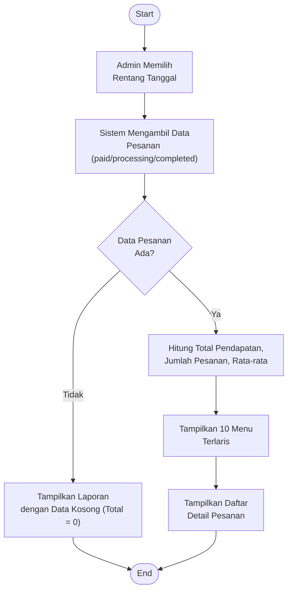
```mermaid
flowchart TD
    Start([Start]) --> PilihTanggal["Admin Memilih\nRentang Tanggal"]
    PilihTanggal --> AmbilData["Sistem Mengambil Data\nPesanan (paid/processing/completed)"]
    AmbilData --> CekData{"Data Pesanan\nAda?"}

    CekData -->|Tidak| LaporanKosong["Tampilkan Laporan\ndengan Data Kosong (Total = 0)"]
    LaporanKosong --> End([End])

    CekData -->|Ya| HitungStatistik["Hitung Total Pendapatan,\nJumlah Pesanan, Rata-rata"]
    HitungStatistik --> TampilTerlaris["Tampilkan 10 Menu\nTerlaris"]
    TampilTerlaris --> TampilDetail["Tampilkan Daftar\nDetail Pesanan"]
    TampilDetail --> End
```

---

## 14. Activity Diagram — UC-14: Terima Pesanan

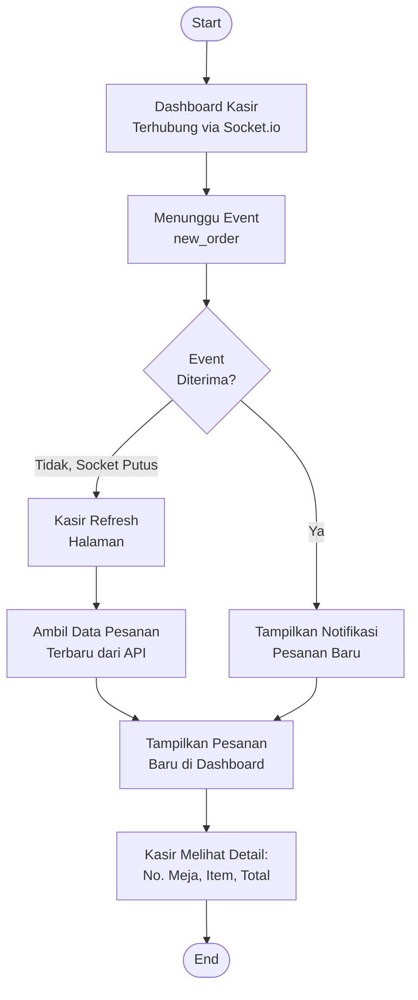
```mermaid
flowchart TD
    Start([Start]) --> KoneksiSocket["Dashboard Kasir\nTerhubung via Socket.io"]
    KoneksiSocket --> TungguEvent["Menunggu Event\nnew_order"]
    TungguEvent --> TerimaEvent{"Event\nDiterima?"}

    TerimaEvent -->|Tidak, Socket Putus| RefreshPage["Kasir Refresh\nHalaman"]
    RefreshPage --> AmbilManual["Ambil Data Pesanan\nTerbaru dari API"]
    AmbilManual --> TampilPesanan["Tampilkan Pesanan\nBaru di Dashboard"]

    TerimaEvent -->|Ya| Notifikasi["Tampilkan Notifikasi\nPesanan Baru"]
    Notifikasi --> TampilPesanan

    TampilPesanan --> LihatDetail["Kasir Melihat Detail:\nNo. Meja, Item, Total"]
    LihatDetail --> End([End])
```

---

## 15. Activity Diagram — UC-15: Update Status Pesanan

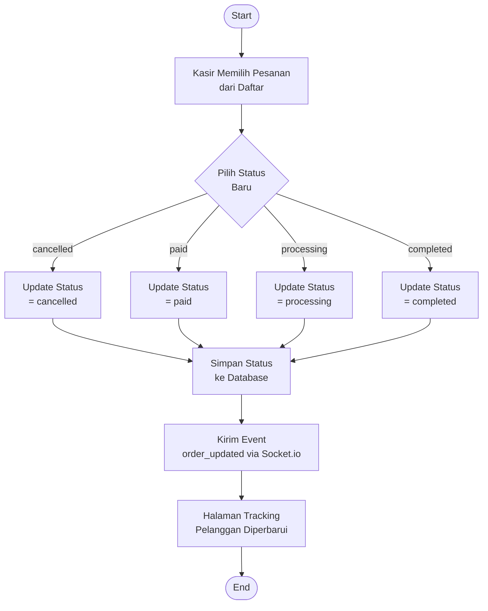
```mermaid
flowchart TD
    Start([Start]) --> PilihPesanan["Kasir Memilih Pesanan\ndari Daftar"]
    PilihPesanan --> PilihStatus{"Pilih Status\nBaru"}

    PilihStatus -->|cancelled| Batalkan["Update Status\n= cancelled"]
    Batalkan --> SimpanDB["Simpan Status\nke Database"]

    PilihStatus -->|paid| StatusPaid["Update Status\n= paid"]
    StatusPaid --> SimpanDB

    PilihStatus -->|processing| StatusProc["Update Status\n= processing"]
    StatusProc --> SimpanDB

    PilihStatus -->|completed| StatusComp["Update Status\n= completed"]
    StatusComp --> SimpanDB

    SimpanDB --> KirimSocket["Kirim Event\norder_updated via Socket.io"]
    KirimSocket --> UpdateTracking["Halaman Tracking\nPelanggan Diperbarui"]
    UpdateTracking --> End([End])
```

---

## 16. Activity Diagram — UC-16: Lihat Riwayat Pesanan

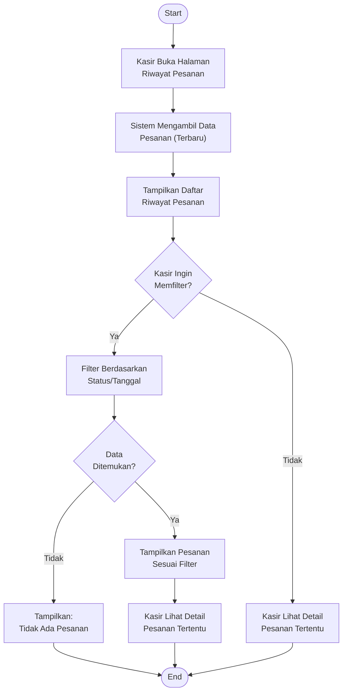
```mermaid
flowchart TD
    Start([Start]) --> BukaRiwayat["Kasir Buka Halaman\nRiwayat Pesanan"]
    BukaRiwayat --> AmbilData["Sistem Mengambil Data\nPesanan (Terbaru)"]
    AmbilData --> TampilDaftar["Tampilkan Daftar\nRiwayat Pesanan"]
    TampilDaftar --> FilterAksi{"Kasir Ingin\nMemfilter?"}

    FilterAksi -->|Ya| PilihFilter["Filter Berdasarkan\nStatus/Tanggal"]
    PilihFilter --> CekHasil{"Data\nDitemukan?"}
    CekHasil -->|Ya| TampilHasil["Tampilkan Pesanan\nSesuai Filter"]
    CekHasil -->|Tidak| PesanKosong["Tampilkan:\nTidak Ada Pesanan"]
    PesanKosong --> End([End])
    TampilHasil --> LihatDetail["Kasir Lihat Detail\nPesanan Tertentu"]
    LihatDetail --> End

    FilterAksi -->|Tidak| LihatDetail2["Kasir Lihat Detail\nPesanan Tertentu"]
    LihatDetail2 --> End
```

---

## 17. Activity Diagram — UC-17: Cetak Struk

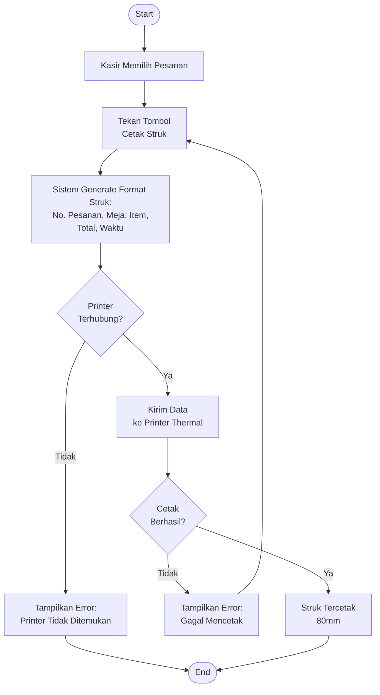
```mermaid
flowchart TD
    Start([Start]) --> PilihPesanan["Kasir Memilih Pesanan"]
    PilihPesanan --> TekanCetak["Tekan Tombol\nCetak Struk"]
    TekanCetak --> GenerateStruk["Sistem Generate Format Struk:\nNo. Pesanan, Meja, Item,\nTotal, Waktu"]
    GenerateStruk --> CekPrinter{"Printer\nTerhubung?"}

    CekPrinter -->|Tidak| ErrorPrinter["Tampilkan Error:\nPrinter Tidak Ditemukan"]
    ErrorPrinter --> End([End])

    CekPrinter -->|Ya| KirimPrinter["Kirim Data\nke Printer Thermal"]
    KirimPrinter --> HasilCetak{"Cetak\nBerhasil?"}

    HasilCetak -->|Tidak| ErrorCetak["Tampilkan Error:\nGagal Mencetak"]
    ErrorCetak --> TekanCetak

    HasilCetak -->|Ya| StrukTercetak["Struk Tercetak\n80mm"]
    StrukTercetak --> End
```

---

## 18. Activity Diagram — UC-18: Logout

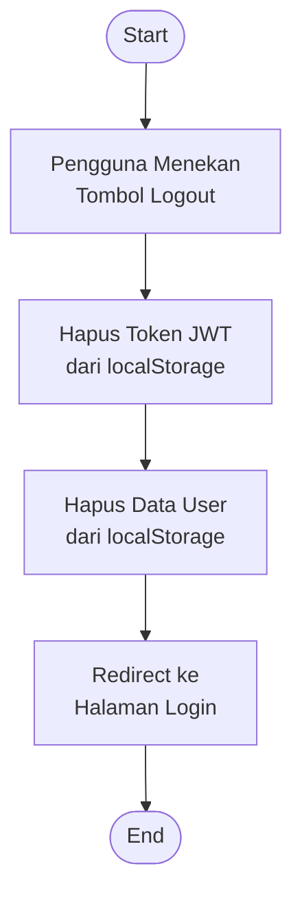
```mermaid
flowchart TD
    Start([Start]) --> TekanLogout["Pengguna Menekan\nTombol Logout"]
    TekanLogout --> HapusToken["Hapus Token JWT\ndari localStorage"]
    HapusToken --> HapusUser["Hapus Data User\ndari localStorage"]
    HapusUser --> RedirectLogin["Redirect ke\nHalaman Login"]
    RedirectLogin --> End([End])
```

---

## 19. Activity Diagram — UC-19: Generate QR Code

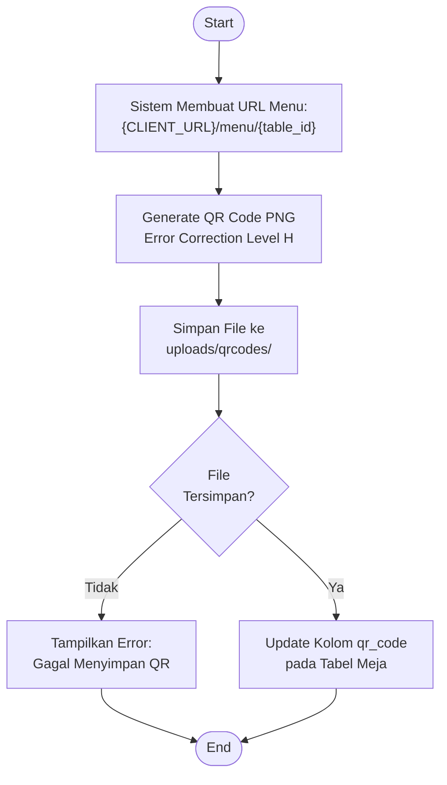
```mermaid
flowchart TD
    Start([Start]) --> BuatURL["Sistem Membuat URL Menu:\n{CLIENT_URL}/menu/{table_id}"]
    BuatURL --> GenerateQR["Generate QR Code PNG\nError Correction Level H"]
    GenerateQR --> SimpanFile["Simpan File ke\nuploads/qrcodes/"]
    SimpanFile --> HasilSimpan{"File\nTersimpan?"}

    HasilSimpan -->|Tidak| ErrorSimpan["Tampilkan Error:\nGagal Menyimpan QR"]
    ErrorSimpan --> End([End])

    HasilSimpan -->|Ya| UpdateDB["Update Kolom qr_code\npada Tabel Meja"]
    UpdateDB --> End
```
