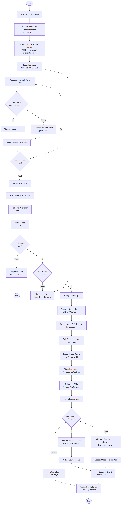
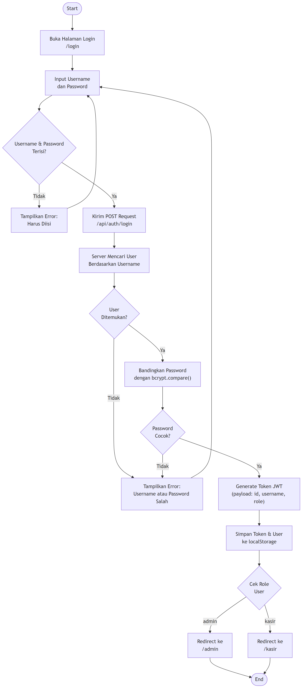
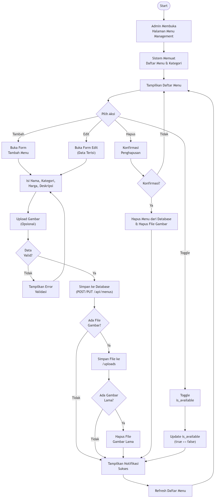
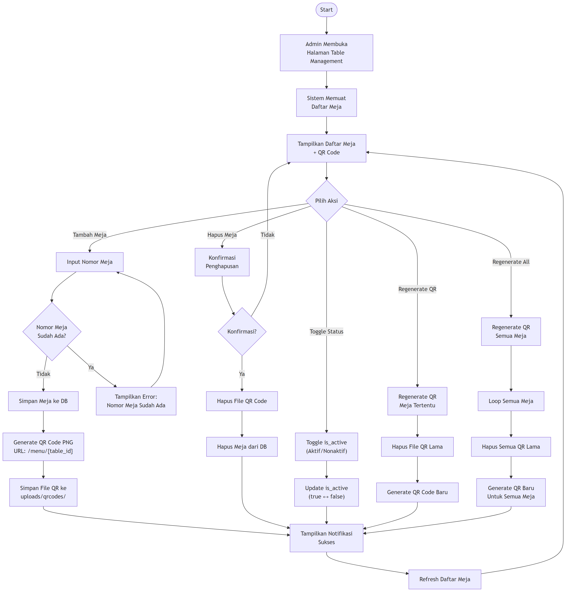
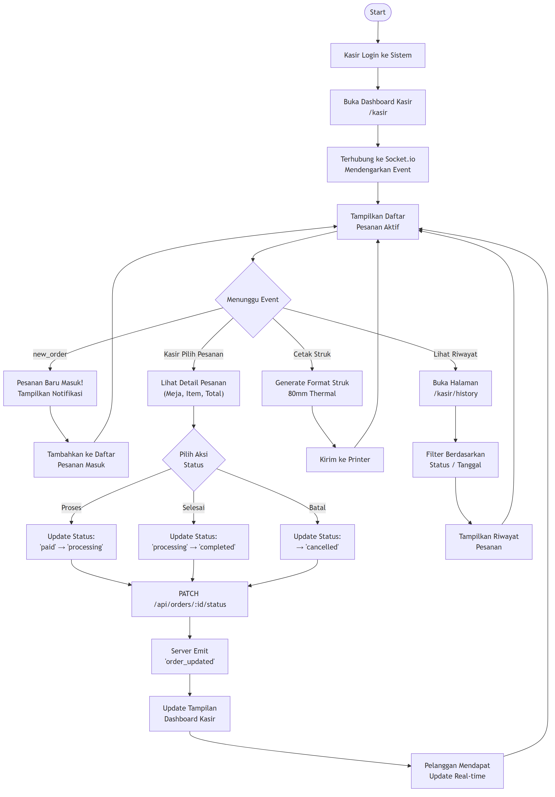
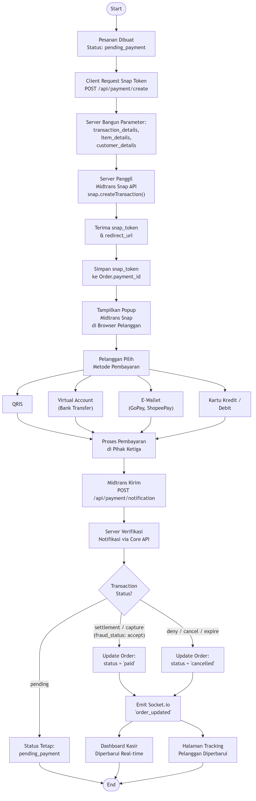
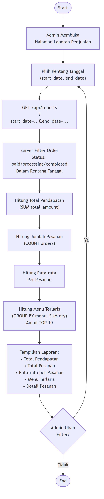
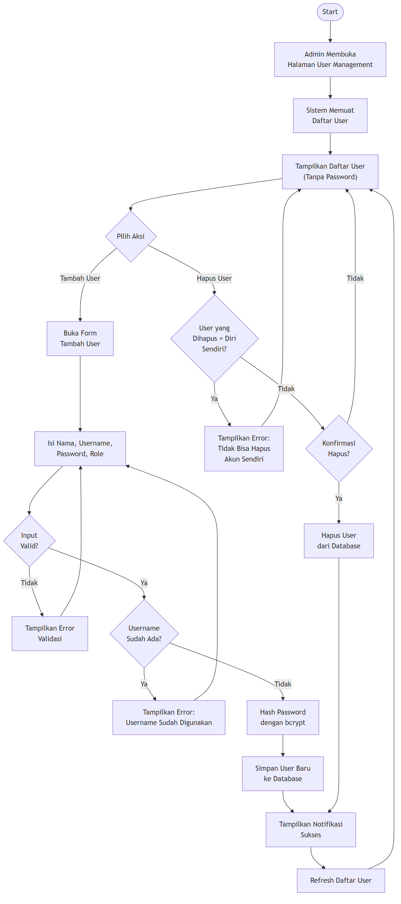

# C. Activity Diagram

## Sistem Pemesanan Menu Kafe Ponbean Coffee

---

## 1. Activity Diagram — Proses Pemesanan Pelanggan (End-to-End)

---

## 2. Activity Diagram — Login Admin/Kasir

---

## 3. Activity Diagram — Kelola Menu (Admin)

---

## 4. Activity Diagram — Kelola Meja & QR Code (Admin)

---

## 5. Activity Diagram — Proses Pesanan oleh Kasir

---

## 6. Activity Diagram — Pembayaran Midtrans

---

## 7. Activity Diagram — Lihat Laporan Penjualan (Admin)

---

## 8. Activity Diagram — Kelola User (Admin)

