# D. Sequence Diagram

## Sistem Pemesanan Menu Kafe Ponbean Coffee

---

## 1. Sequence Diagram — UC-01: Scan QR Code

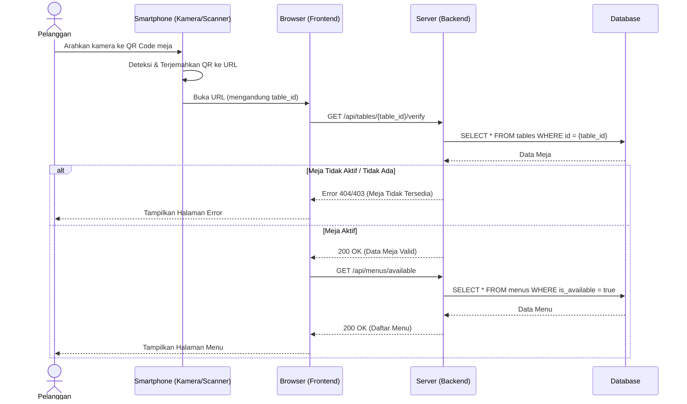
```mermaid
sequenceDiagram
    actor P as Pelanggan
    participant HP as Smartphone (Kamera/Scanner)
    participant B as Browser (Frontend)
    participant S as Server (Backend)
    participant DB as Database

    P->>HP: Arahkan kamera ke QR Code meja
    HP->>HP: Deteksi & Terjemahkan QR ke URL
    HP->>B: Buka URL (mengandung table_id)
    B->>S: GET /api/tables/{table_id}/verify
    S->>DB: SELECT * FROM tables WHERE id = {table_id}
    DB-->>S: Data Meja
    alt Meja Tidak Aktif / Tidak Ada
        S-->>B: Error 404/403 (Meja Tidak Tersedia)
        B-->>P: Tampilkan Halaman Error
    else Meja Aktif
        S-->>B: 200 OK (Data Meja Valid)
        B->>S: GET /api/menus/available
        S->>DB: SELECT * FROM menus WHERE is_available = true
        DB-->>S: Data Menu
        S-->>B: 200 OK (Daftar Menu)
        B-->>P: Tampilkan Halaman Menu
    end
```

---

## 2. Sequence Diagram — UC-02: Tambah ke Keranjang

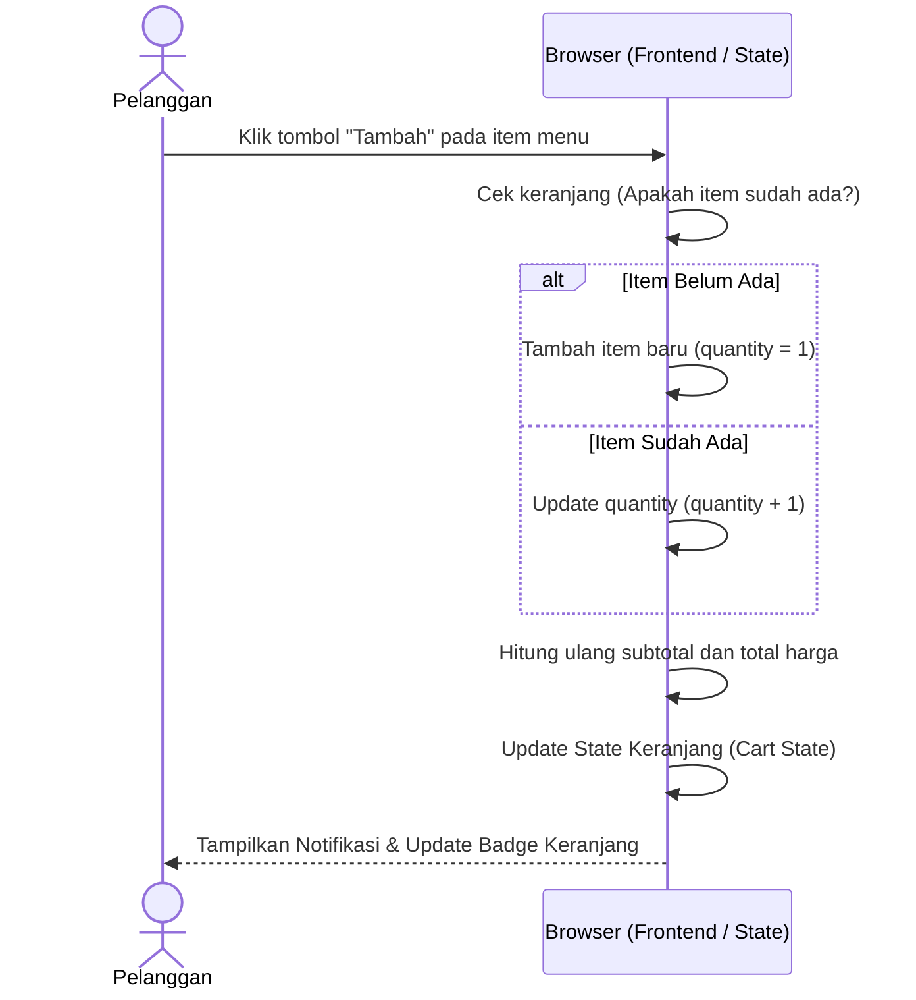
```mermaid
sequenceDiagram
    actor P as Pelanggan
    participant B as Browser (Frontend / State)

    P->>B: Klik tombol "Tambah" pada item menu
    B->>B: Cek keranjang (Apakah item sudah ada?)
    alt Item Belum Ada
        B->>B: Tambah item baru (quantity = 1)
    else Item Sudah Ada
        B->>B: Update quantity (quantity + 1)
    end
    B->>B: Hitung ulang subtotal dan total harga
    B->>B: Update State Keranjang (Cart State)
    B-->>P: Tampilkan Notifikasi & Update Badge Keranjang
```

---

## 3. Sequence Diagram — UC-03: Kelola Keranjang

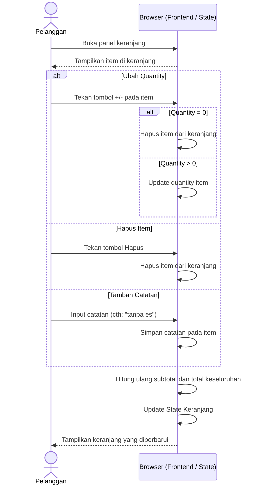
```mermaid
sequenceDiagram
    actor P as Pelanggan
    participant B as Browser (Frontend / State)

    P->>B: Buka panel keranjang
    B-->>P: Tampilkan item di keranjang
    
    alt Ubah Quantity
        P->>B: Tekan tombol +/- pada item
        alt Quantity = 0
            B->>B: Hapus item dari keranjang
        else Quantity > 0
            B->>B: Update quantity item
        end
    else Hapus Item
        P->>B: Tekan tombol Hapus
        B->>B: Hapus item dari keranjang
    else Tambah Catatan
        P->>B: Input catatan (cth: "tanpa es")
        B->>B: Simpan catatan pada item
    end

    B->>B: Hitung ulang subtotal dan total keseluruhan
    B->>B: Update State Keranjang
    B-->>P: Tampilkan keranjang yang diperbarui
```

---

## 4. Sequence Diagram — UC-04: Buat Pesanan

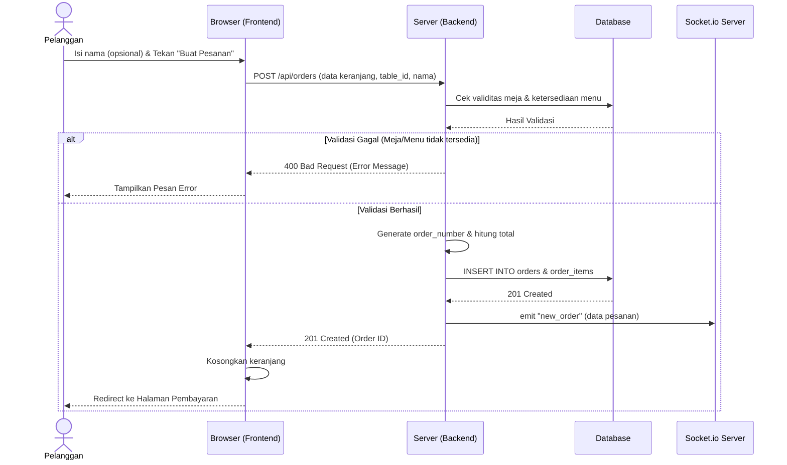
```mermaid
sequenceDiagram
    actor P as Pelanggan
    participant B as Browser (Frontend)
    participant S as Server (Backend)
    participant DB as Database
    participant Sock as Socket.io Server

    P->>B: Isi nama (opsional) & Tekan "Buat Pesanan"
    B->>S: POST /api/orders (data keranjang, table_id, nama)
    
    S->>DB: Cek validitas meja & ketersediaan menu
    DB-->>S: Hasil Validasi
    
    alt Validasi Gagal (Meja/Menu tidak tersedia)
        S-->>B: 400 Bad Request (Error Message)
        B-->>P: Tampilkan Pesan Error
    else Validasi Berhasil
        S->>S: Generate order_number & hitung total
        S->>DB: INSERT INTO orders & order_items
        DB-->>S: 201 Created
        S->>Sock: emit "new_order" (data pesanan)
        S-->>B: 201 Created (Order ID)
        B->>B: Kosongkan keranjang
        B-->>P: Redirect ke Halaman Pembayaran
    end
```

---

## 5. Sequence Diagram — UC-05: Bayar Pesanan

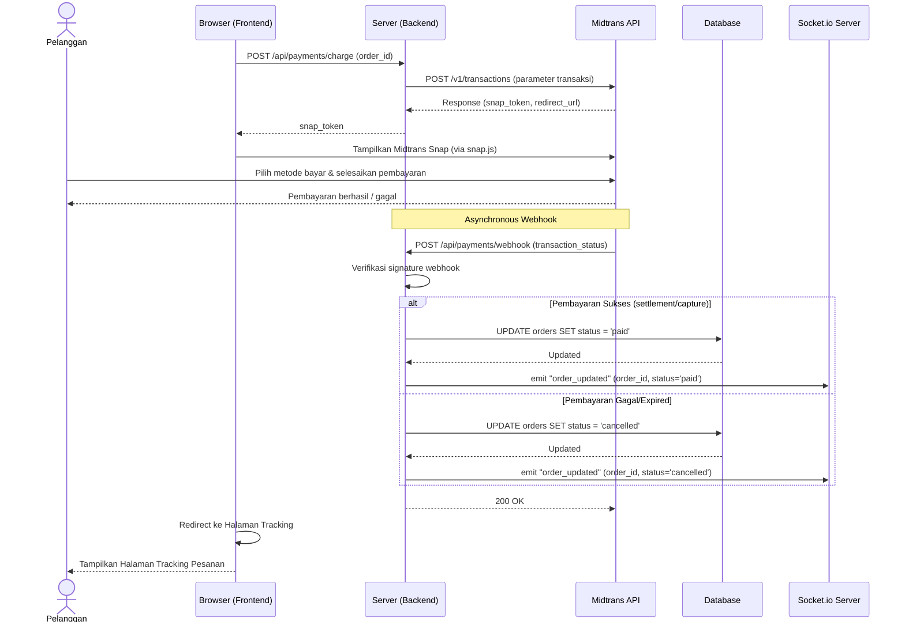
```mermaid
sequenceDiagram
    actor P as Pelanggan
    participant B as Browser (Frontend)
    participant S as Server (Backend)
    participant M as Midtrans API
    participant DB as Database
    participant Sock as Socket.io Server

    B->>S: POST /api/payments/charge (order_id)
    S->>M: POST /v1/transactions (parameter transaksi)
    M-->>S: Response (snap_token, redirect_url)
    S-->>B: snap_token
    B->>M: Tampilkan Midtrans Snap (via snap.js)
    P->>M: Pilih metode bayar & selesaikan pembayaran
    M-->>P: Pembayaran berhasil / gagal
    
    Note over M,S: Asynchronous Webhook
    M->>S: POST /api/payments/webhook (transaction_status)
    S->>S: Verifikasi signature webhook
    alt Pembayaran Sukses (settlement/capture)
        S->>DB: UPDATE orders SET status = 'paid'
        DB-->>S: Updated
        S->>Sock: emit "order_updated" (order_id, status='paid')
    else Pembayaran Gagal/Expired
        S->>DB: UPDATE orders SET status = 'cancelled'
        DB-->>S: Updated
        S->>Sock: emit "order_updated" (order_id, status='cancelled')
    end
    S-->>M: 200 OK
    
    B->>B: Redirect ke Halaman Tracking
    B-->>P: Tampilkan Halaman Tracking Pesanan
```

---

## 6. Sequence Diagram — UC-06: Tracking Pesanan

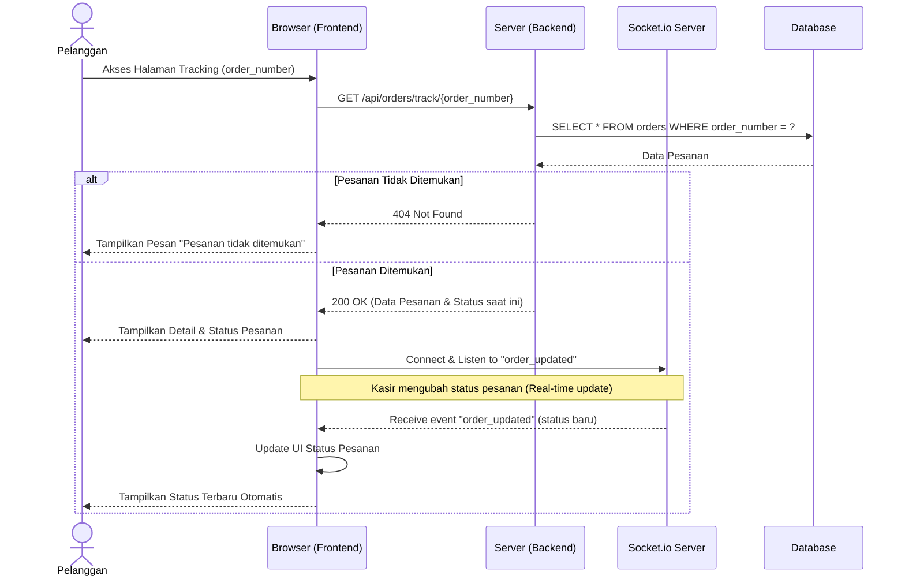
```mermaid
sequenceDiagram
    actor P as Pelanggan
    participant B as Browser (Frontend)
    participant S as Server (Backend)
    participant Sock as Socket.io Server
    participant DB as Database

    P->>B: Akses Halaman Tracking (order_number)
    B->>S: GET /api/orders/track/{order_number}
    S->>DB: SELECT * FROM orders WHERE order_number = ?
    DB-->>S: Data Pesanan
    
    alt Pesanan Tidak Ditemukan
        S-->>B: 404 Not Found
        B-->>P: Tampilkan Pesan "Pesanan tidak ditemukan"
    else Pesanan Ditemukan
        S-->>B: 200 OK (Data Pesanan & Status saat ini)
        B-->>P: Tampilkan Detail & Status Pesanan
        
        B->>Sock: Connect & Listen to "order_updated"
        
        Note over Sock,B: Kasir mengubah status pesanan (Real-time update)
        Sock-->>B: Receive event "order_updated" (status baru)
        B->>B: Update UI Status Pesanan
        B-->>P: Tampilkan Status Terbaru Otomatis
    end
```

---

## 7. Sequence Diagram — UC-07: Login

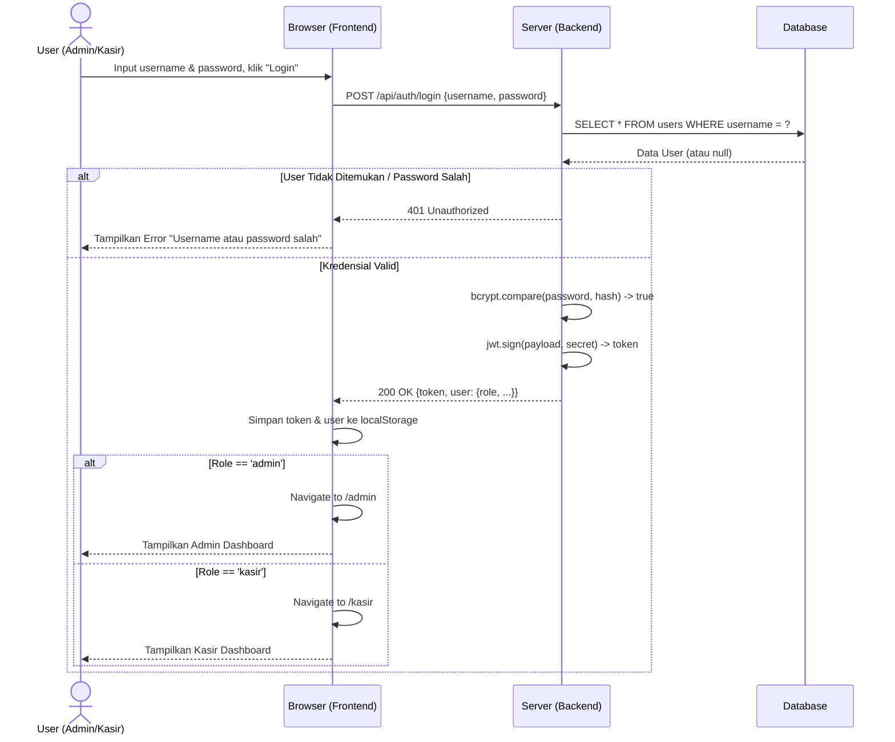
```mermaid
sequenceDiagram
    actor U as User (Admin/Kasir)
    participant B as Browser (Frontend)
    participant S as Server (Backend)
    participant DB as Database

    U->>B: Input username & password, klik "Login"
    B->>S: POST /api/auth/login {username, password}
    
    S->>DB: SELECT * FROM users WHERE username = ?
    DB-->>S: Data User (atau null)
    
    alt User Tidak Ditemukan / Password Salah
        S-->>B: 401 Unauthorized
        B-->>U: Tampilkan Error "Username atau password salah"
    else Kredensial Valid
        S->>S: bcrypt.compare(password, hash) -> true
        S->>S: jwt.sign(payload, secret) -> token
        S-->>B: 200 OK {token, user: {role, ...}}
        
        B->>B: Simpan token & user ke localStorage
        alt Role == 'admin'
            B->>B: Navigate to /admin
            B-->>U: Tampilkan Admin Dashboard
        else Role == 'kasir'
            B->>B: Navigate to /kasir
            B-->>U: Tampilkan Kasir Dashboard
        end
    end
```

---

## 8. Sequence Diagram — UC-08: Kelola Menu (CRUD)

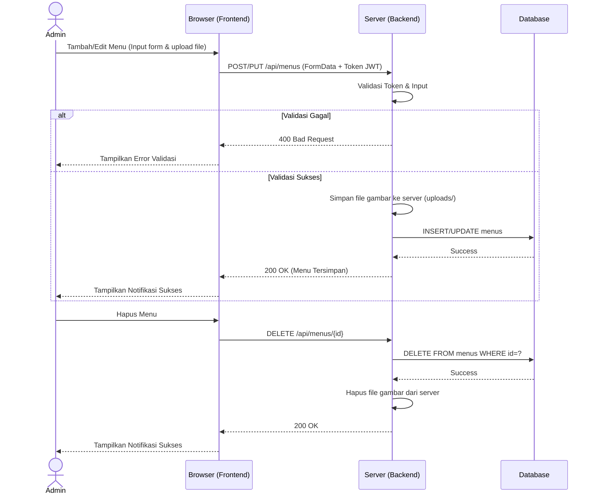
```mermaid
sequenceDiagram
    actor A as Admin
    participant B as Browser (Frontend)
    participant S as Server (Backend)
    participant DB as Database

    A->>B: Tambah/Edit Menu (Input form & upload file)
    B->>S: POST/PUT /api/menus (FormData + Token JWT)
    S->>S: Validasi Token & Input
    alt Validasi Gagal
        S-->>B: 400 Bad Request
        B-->>A: Tampilkan Error Validasi
    else Validasi Sukses
        S->>S: Simpan file gambar ke server (uploads/)
        S->>DB: INSERT/UPDATE menus
        DB-->>S: Success
        S-->>B: 200 OK (Menu Tersimpan)
        B-->>A: Tampilkan Notifikasi Sukses
    end
    
    A->>B: Hapus Menu
    B->>S: DELETE /api/menus/{id}
    S->>DB: DELETE FROM menus WHERE id=?
    DB-->>S: Success
    S->>S: Hapus file gambar dari server
    S-->>B: 200 OK
    B-->>A: Tampilkan Notifikasi Sukses
```

---

## 9. Sequence Diagram — UC-09: Kelola Kategori

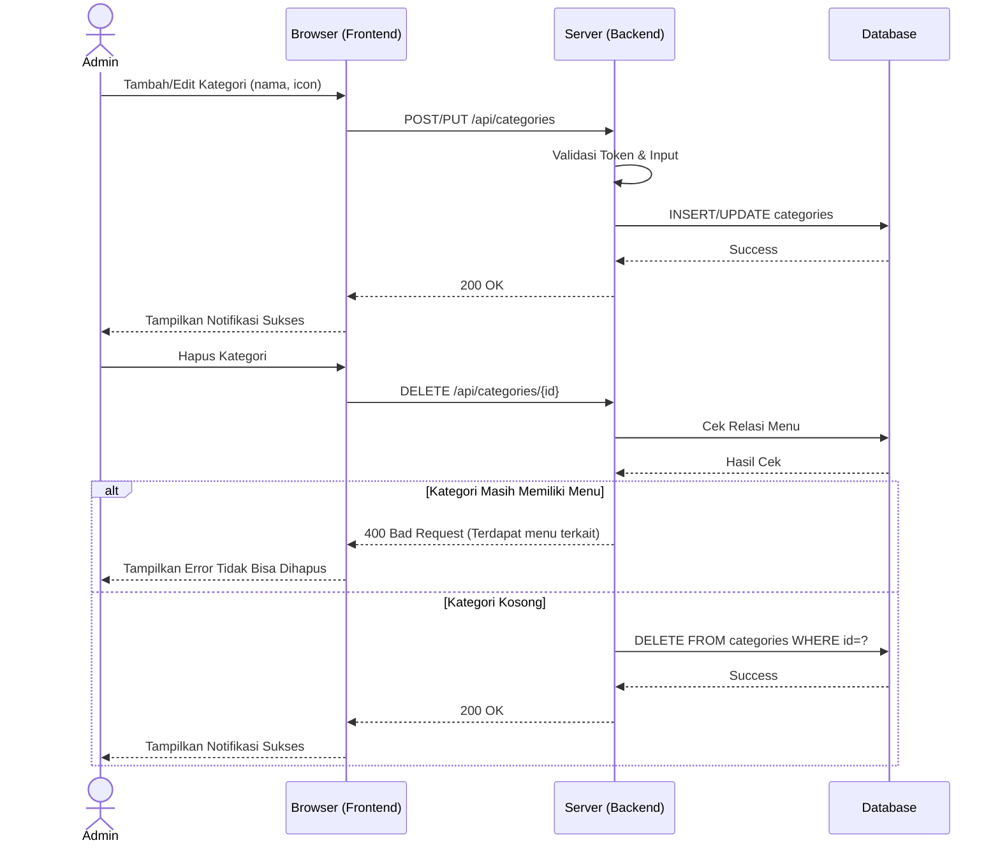
```mermaid
sequenceDiagram
    actor A as Admin
    participant B as Browser (Frontend)
    participant S as Server (Backend)
    participant DB as Database

    A->>B: Tambah/Edit Kategori (nama, icon)
    B->>S: POST/PUT /api/categories
    S->>S: Validasi Token & Input
    S->>DB: INSERT/UPDATE categories
    DB-->>S: Success
    S-->>B: 200 OK
    B-->>A: Tampilkan Notifikasi Sukses
    
    A->>B: Hapus Kategori
    B->>S: DELETE /api/categories/{id}
    S->>DB: Cek Relasi Menu
    DB-->>S: Hasil Cek
    alt Kategori Masih Memiliki Menu
        S-->>B: 400 Bad Request (Terdapat menu terkait)
        B-->>A: Tampilkan Error Tidak Bisa Dihapus
    else Kategori Kosong
        S->>DB: DELETE FROM categories WHERE id=?
        DB-->>S: Success
        S-->>B: 200 OK
        B-->>A: Tampilkan Notifikasi Sukses
    end
```

---

## 10. Sequence Diagram — UC-10: Kelola Meja

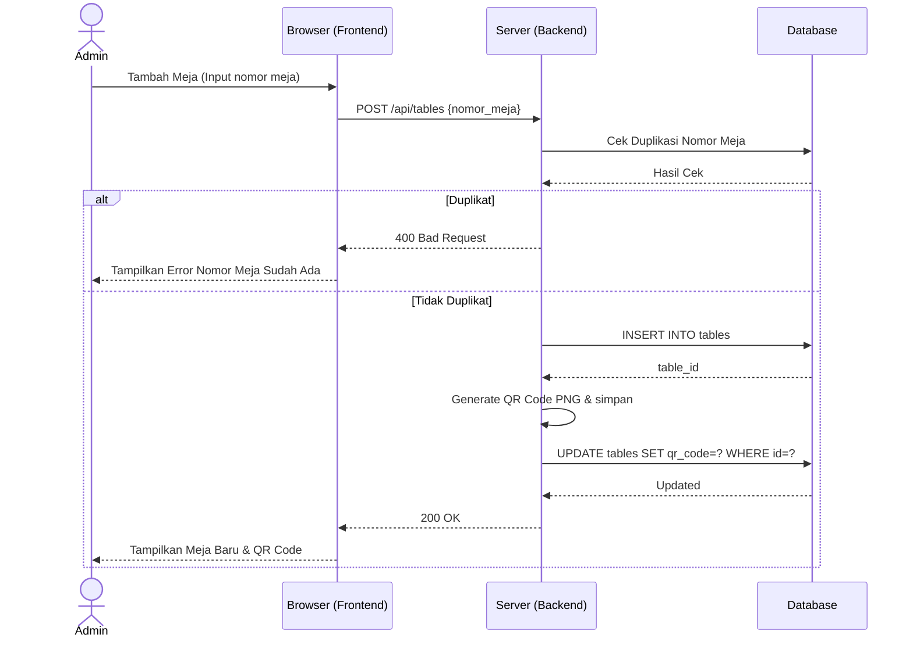
```mermaid
sequenceDiagram
    actor A as Admin
    participant B as Browser (Frontend)
    participant S as Server (Backend)
    participant DB as Database

    A->>B: Tambah Meja (Input nomor meja)
    B->>S: POST /api/tables {nomor_meja}
    S->>DB: Cek Duplikasi Nomor Meja
    DB-->>S: Hasil Cek
    alt Duplikat
        S-->>B: 400 Bad Request
        B-->>A: Tampilkan Error Nomor Meja Sudah Ada
    else Tidak Duplikat
        S->>DB: INSERT INTO tables
        DB-->>S: table_id
        S->>S: Generate QR Code PNG & simpan
        S->>DB: UPDATE tables SET qr_code=? WHERE id=?
        DB-->>S: Updated
        S-->>B: 200 OK
        B-->>A: Tampilkan Meja Baru & QR Code
    end
```

---

## 11. Sequence Diagram — UC-11: Kelola User

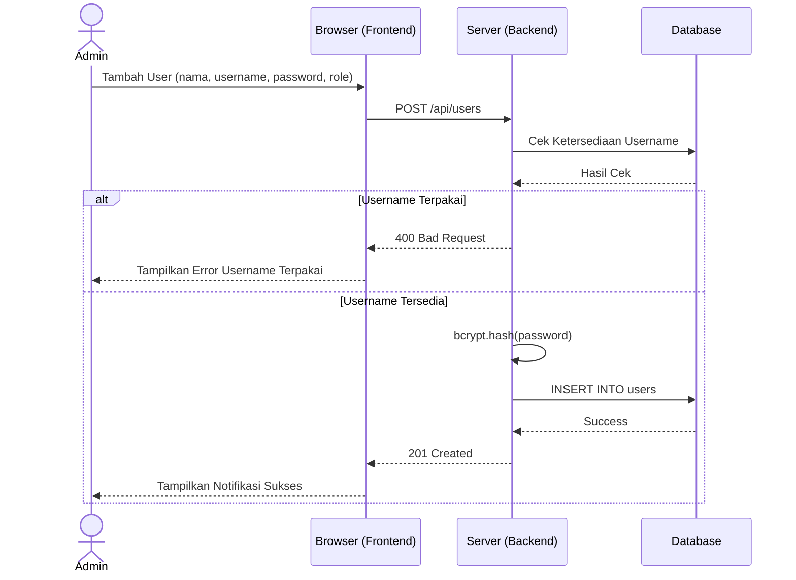
```mermaid
sequenceDiagram
    actor A as Admin
    participant B as Browser (Frontend)
    participant S as Server (Backend)
    participant DB as Database

    A->>B: Tambah User (nama, username, password, role)
    B->>S: POST /api/users
    S->>DB: Cek Ketersediaan Username
    DB-->>S: Hasil Cek
    alt Username Terpakai
        S-->>B: 400 Bad Request
        B-->>A: Tampilkan Error Username Terpakai
    else Username Tersedia
        S->>S: bcrypt.hash(password)
        S->>DB: INSERT INTO users
        DB-->>S: Success
        S-->>B: 201 Created
        B-->>A: Tampilkan Notifikasi Sukses
    end
```

---

## 12. Sequence Diagram — UC-12: Lihat Dashboard

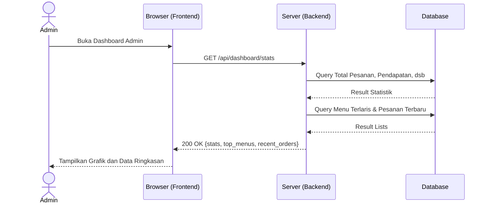
```mermaid
sequenceDiagram
    actor A as Admin
    participant B as Browser (Frontend)
    participant S as Server (Backend)
    participant DB as Database

    A->>B: Buka Dashboard Admin
    B->>S: GET /api/dashboard/stats
    S->>DB: Query Total Pesanan, Pendapatan, dsb
    DB-->>S: Result Statistik
    S->>DB: Query Menu Terlaris & Pesanan Terbaru
    DB-->>S: Result Lists
    S-->>B: 200 OK {stats, top_menus, recent_orders}
    B-->>A: Tampilkan Grafik dan Data Ringkasan
```

---

## 13. Sequence Diagram — UC-13: Lihat Laporan Penjualan

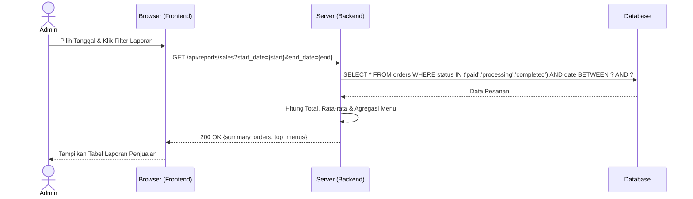
```mermaid
sequenceDiagram
    actor A as Admin
    participant B as Browser (Frontend)
    participant S as Server (Backend)
    participant DB as Database

    A->>B: Pilih Tanggal & Klik Filter Laporan
    B->>S: GET /api/reports/sales?start_date={start}&end_date={end}
    S->>DB: SELECT * FROM orders WHERE status IN ('paid','processing','completed') AND date BETWEEN ? AND ?
    DB-->>S: Data Pesanan
    S->>S: Hitung Total, Rata-rata & Agregasi Menu
    S-->>B: 200 OK {summary, orders, top_menus}
    B-->>A: Tampilkan Tabel Laporan Penjualan
```

---

## 14. Sequence Diagram — UC-14: Terima Pesanan

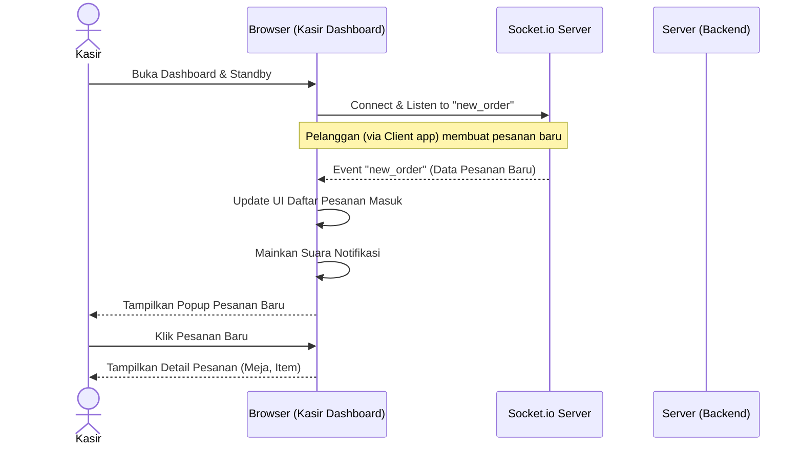
```mermaid
sequenceDiagram
    actor K as Kasir
    participant B as Browser (Kasir Dashboard)
    participant Sock as Socket.io Server
    participant S as Server (Backend)

    K->>B: Buka Dashboard & Standby
    B->>Sock: Connect & Listen to "new_order"
    
    Note over Sock,B: Pelanggan (via Client app) membuat pesanan baru
    Sock-->>B: Event "new_order" (Data Pesanan Baru)
    
    B->>B: Update UI Daftar Pesanan Masuk
    B->>B: Mainkan Suara Notifikasi
    B-->>K: Tampilkan Popup Pesanan Baru
    
    K->>B: Klik Pesanan Baru
    B-->>K: Tampilkan Detail Pesanan (Meja, Item)
```

---

## 15. Sequence Diagram — UC-15: Update Status Pesanan

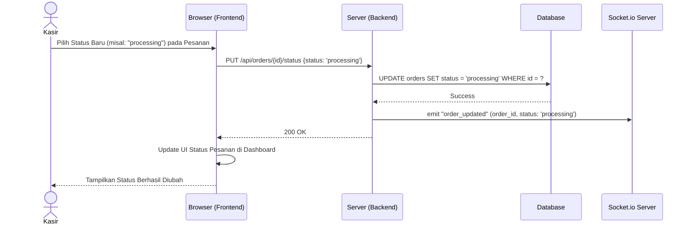
```mermaid
sequenceDiagram
    actor K as Kasir
    participant B as Browser (Frontend)
    participant S as Server (Backend)
    participant DB as Database
    participant Sock as Socket.io Server

    K->>B: Pilih Status Baru (misal: "processing") pada Pesanan
    B->>S: PUT /api/orders/{id}/status {status: 'processing'}
    
    S->>DB: UPDATE orders SET status = 'processing' WHERE id = ?
    DB-->>S: Success
    
    S->>Sock: emit "order_updated" (order_id, status: 'processing')
    S-->>B: 200 OK
    B->>B: Update UI Status Pesanan di Dashboard
    B-->>K: Tampilkan Status Berhasil Diubah
```

---

## 16. Sequence Diagram — UC-16: Lihat Riwayat Pesanan

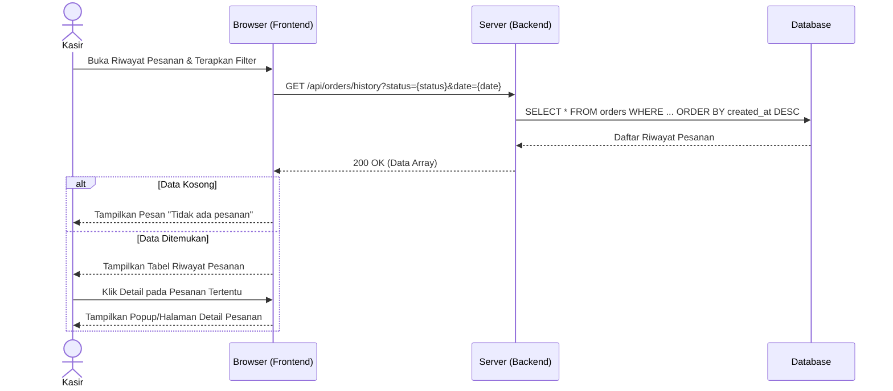
```mermaid
sequenceDiagram
    actor K as Kasir
    participant B as Browser (Frontend)
    participant S as Server (Backend)
    participant DB as Database

    K->>B: Buka Riwayat Pesanan & Terapkan Filter
    B->>S: GET /api/orders/history?status={status}&date={date}
    S->>DB: SELECT * FROM orders WHERE ... ORDER BY created_at DESC
    DB-->>S: Daftar Riwayat Pesanan
    S-->>B: 200 OK (Data Array)
    
    alt Data Kosong
        B-->>K: Tampilkan Pesan "Tidak ada pesanan"
    else Data Ditemukan
        B-->>K: Tampilkan Tabel Riwayat Pesanan
        K->>B: Klik Detail pada Pesanan Tertentu
        B-->>K: Tampilkan Popup/Halaman Detail Pesanan
    end
```

---

## 17. Sequence Diagram — UC-17: Cetak Struk

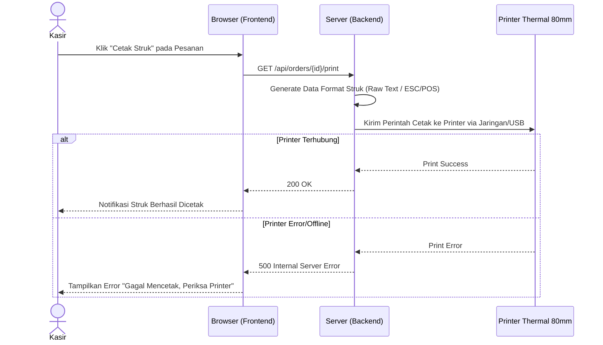
```mermaid
sequenceDiagram
    actor K as Kasir
    participant B as Browser (Frontend)
    participant S as Server (Backend)
    participant P as Printer Thermal 80mm

    K->>B: Klik "Cetak Struk" pada Pesanan
    B->>S: GET /api/orders/{id}/print
    S->>S: Generate Data Format Struk (Raw Text / ESC/POS)
    
    S->>P: Kirim Perintah Cetak ke Printer via Jaringan/USB
    alt Printer Terhubung
        P-->>S: Print Success
        S-->>B: 200 OK
        B-->>K: Notifikasi Struk Berhasil Dicetak
    else Printer Error/Offline
        P-->>S: Print Error
        S-->>B: 500 Internal Server Error
        B-->>K: Tampilkan Error "Gagal Mencetak, Periksa Printer"
    end
```

---

## 18. Sequence Diagram — UC-18: Logout

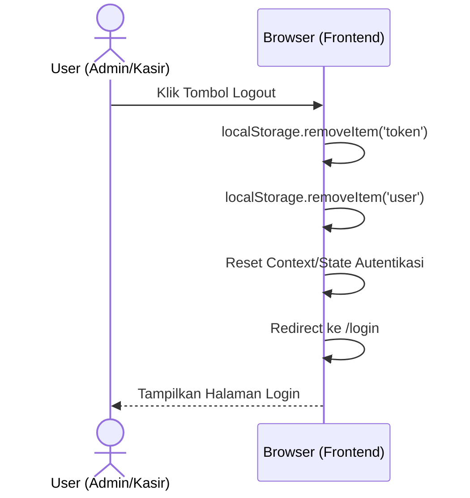
```mermaid
sequenceDiagram
    actor U as User (Admin/Kasir)
    participant B as Browser (Frontend)
    
    U->>B: Klik Tombol Logout
    B->>B: localStorage.removeItem('token')
    B->>B: localStorage.removeItem('user')
    B->>B: Reset Context/State Autentikasi
    B->>B: Redirect ke /login
    B-->>U: Tampilkan Halaman Login
```

---

## 19. Sequence Diagram — UC-19: Generate QR Code

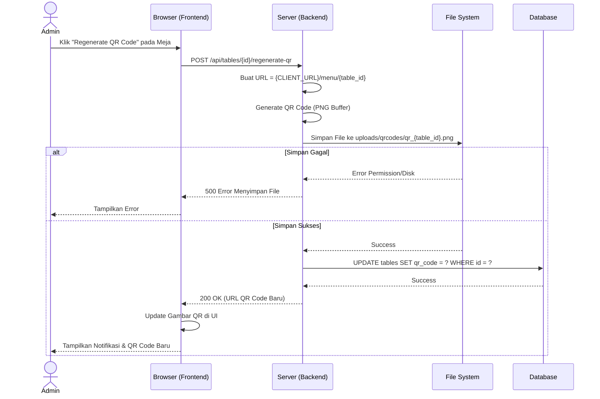
```mermaid
sequenceDiagram
    actor A as Admin
    participant B as Browser (Frontend)
    participant S as Server (Backend)
    participant FS as File System
    participant DB as Database

    A->>B: Klik "Regenerate QR Code" pada Meja
    B->>S: POST /api/tables/{id}/regenerate-qr
    
    S->>S: Buat URL = {CLIENT_URL}/menu/{table_id}
    S->>S: Generate QR Code (PNG Buffer)
    
    S->>FS: Simpan File ke uploads/qrcodes/qr_{table_id}.png
    alt Simpan Gagal
        FS-->>S: Error Permission/Disk
        S-->>B: 500 Error Menyimpan File
        B-->>A: Tampilkan Error
    else Simpan Sukses
        FS-->>S: Success
        S->>DB: UPDATE tables SET qr_code = ? WHERE id = ?
        DB-->>S: Success
        S-->>B: 200 OK (URL QR Code Baru)
        B->>B: Update Gambar QR di UI
        B-->>A: Tampilkan Notifikasi & QR Code Baru
    end
```
