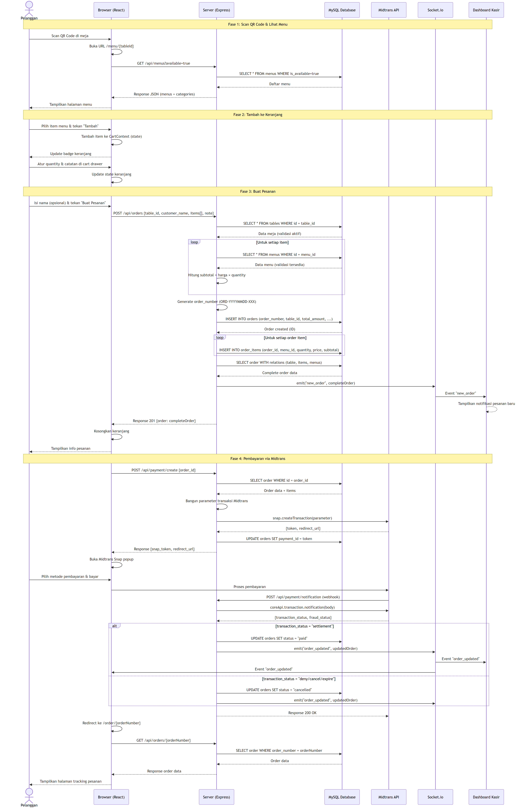
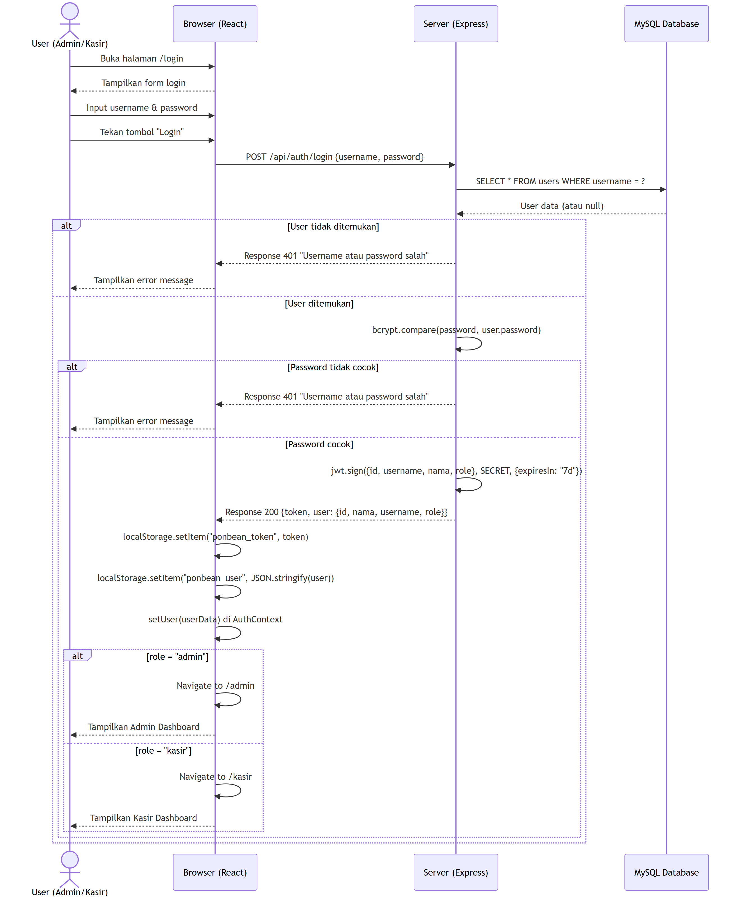
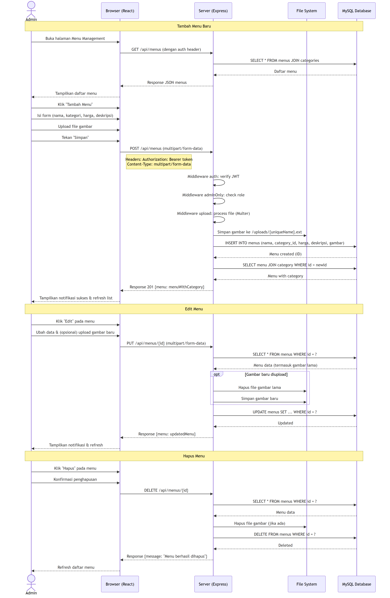
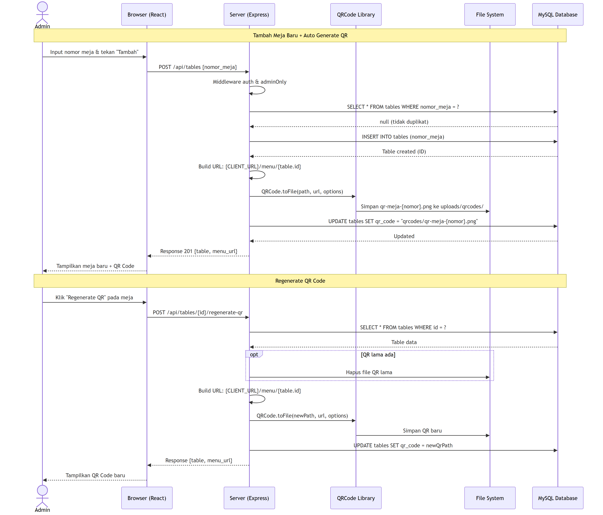
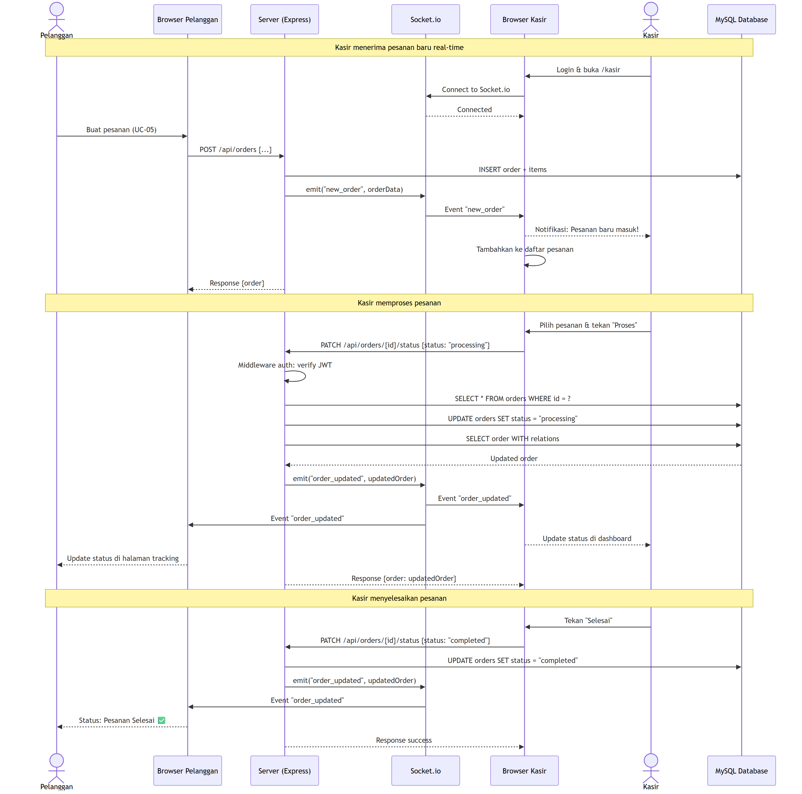
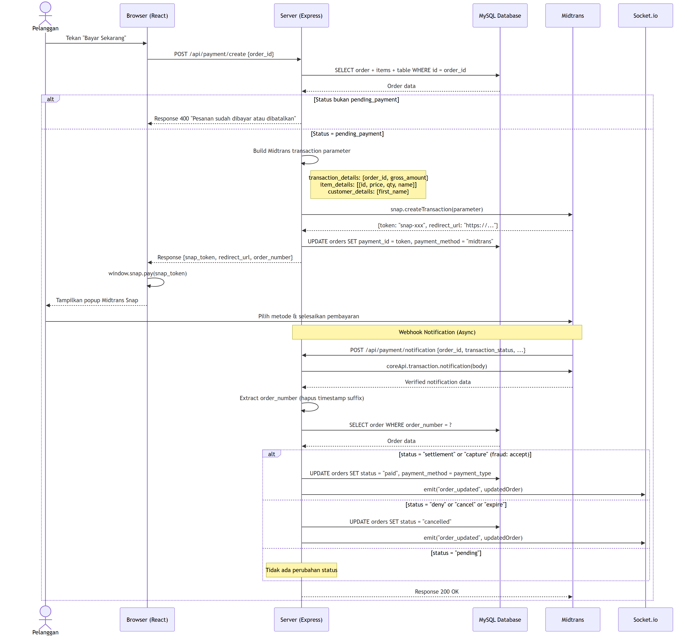
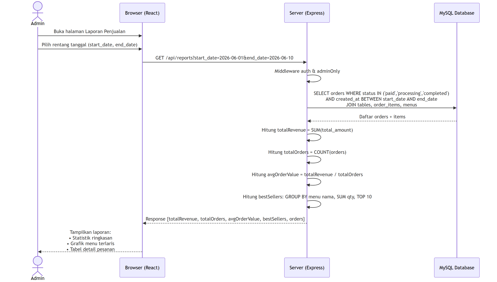
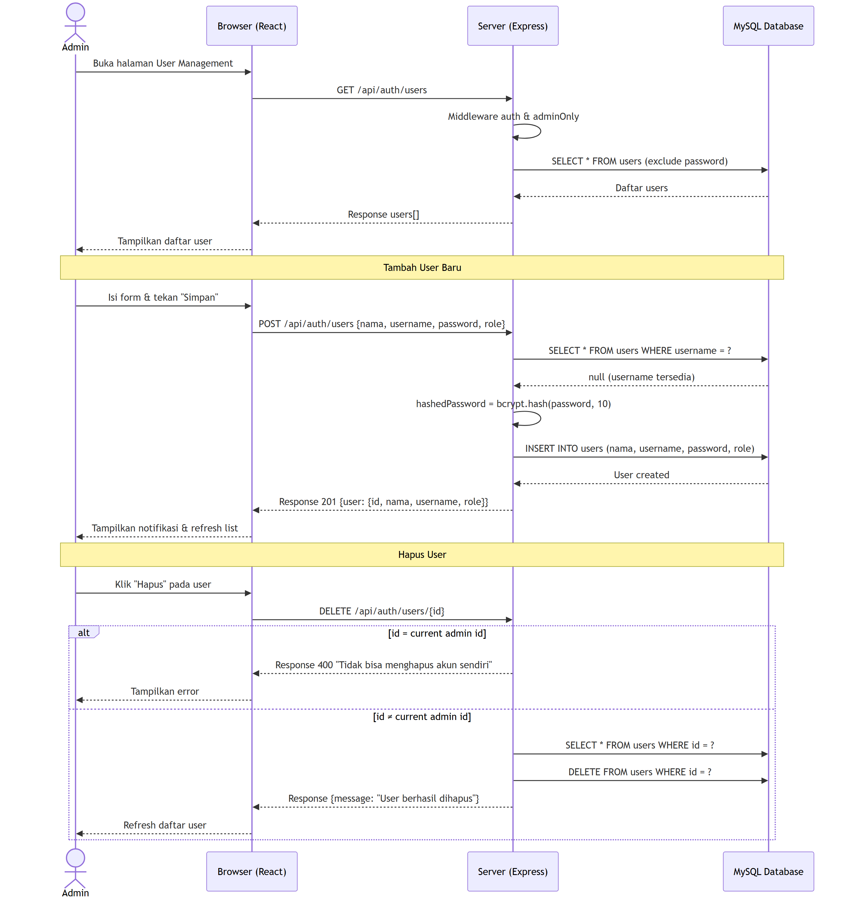

# D. Sequence Diagram

## Sistem Pemesanan Menu Kafe Ponbean Coffee

---

## 1. Sequence Diagram — Proses Pemesanan Pelanggan (End-to-End)

---

## 2. Sequence Diagram — Login Admin/Kasir

---

## 3. Sequence Diagram — Kelola Menu (CRUD)

---

## 4. Sequence Diagram — Kelola Meja & Generate QR Code

---

## 5. Sequence Diagram — Proses Pesanan oleh Kasir (Real-Time)

---

## 6. Sequence Diagram — Pembayaran Midtrans (Detail)

---

## 7. Sequence Diagram — Lihat Laporan Penjualan

---

## 8. Sequence Diagram — Kelola User

