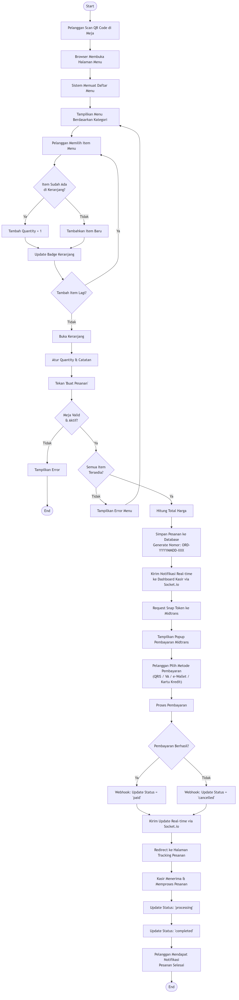
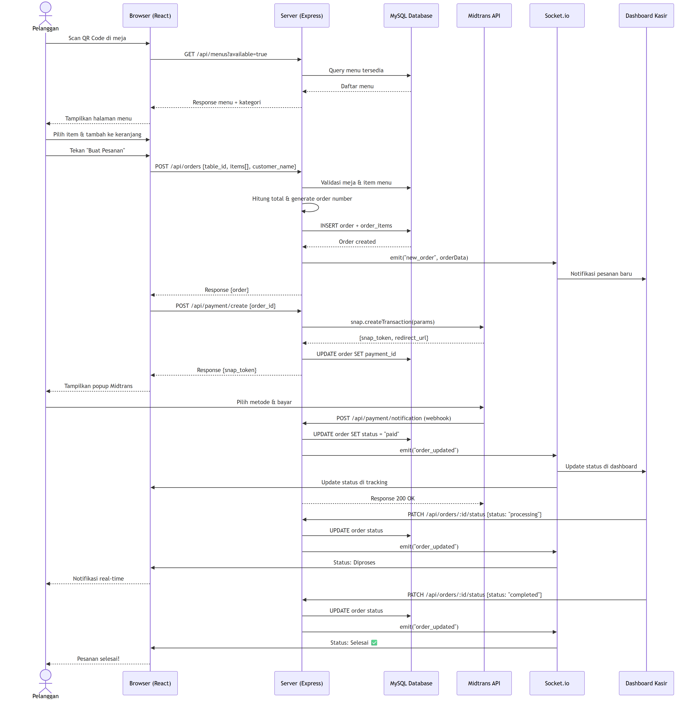
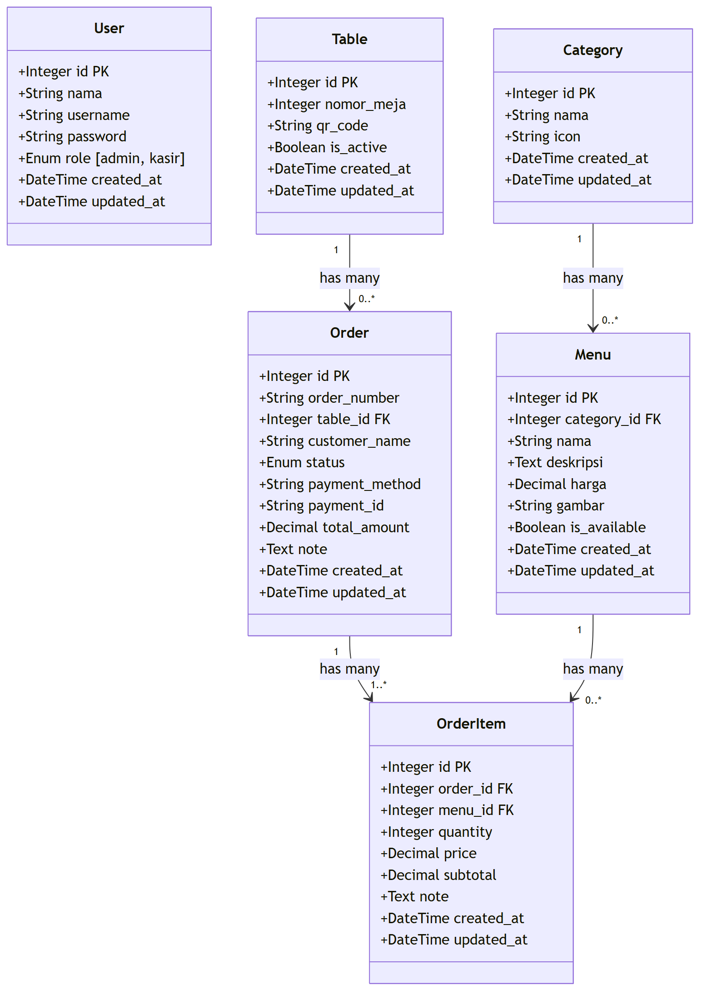
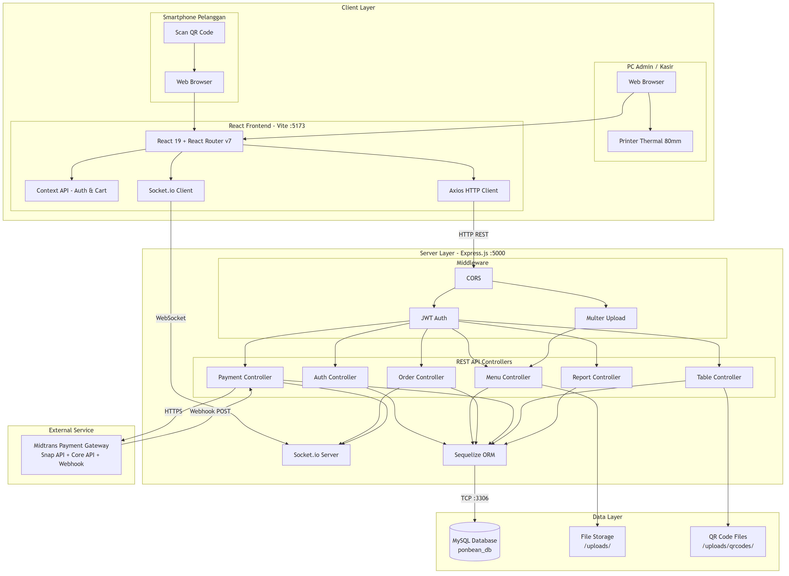

# Diagram Utama — Sistem Pemesanan Menu Kafe Ponbean Coffee

Dokumen ini berisi 5 diagram utama yang merangkum arsitektur dan alur kerja sistem pemesanan menu digital Ponbean Coffee.

---

## 1. Use Case Diagram

Diagram ini menampilkan seluruh use case dalam sistem beserta aktor-aktor yang terlibat: **Pelanggan**, **Admin**, **Kasir**, dan **Midtrans (Payment Gateway)**.

---

## 2. Activity Diagram

Diagram ini menggambarkan alur aktivitas utama dari perspektif pelanggan secara end-to-end: mulai dari **Scan QR Code**, memilih menu, membuat pesanan, pembayaran via Midtrans, hingga pesanan selesai diproses kasir.

---

## 3. Sequence Diagram

Diagram ini menunjukkan interaksi teknis antar komponen sistem secara berurutan: **Pelanggan → Browser (React) → Server (Express) → MySQL → Midtrans → Socket.io → Dashboard Kasir**.

---

## 4. Class Diagram

Diagram ini menampilkan 6 model data (entitas) dalam sistem beserta atribut dan relasi antar tabel: **User**, **Category**, **Menu**, **Table**, **Order**, dan **OrderItem**.

---

## 5. Deployment Diagram

Diagram ini menggambarkan arsitektur deployment sistem secara keseluruhan dalam 3 layer: **Client Layer** (React Frontend + Browser), **Server Layer** (Express.js + Middleware + Controller + Socket.io), dan **Data Layer** (MySQL + File Storage).

