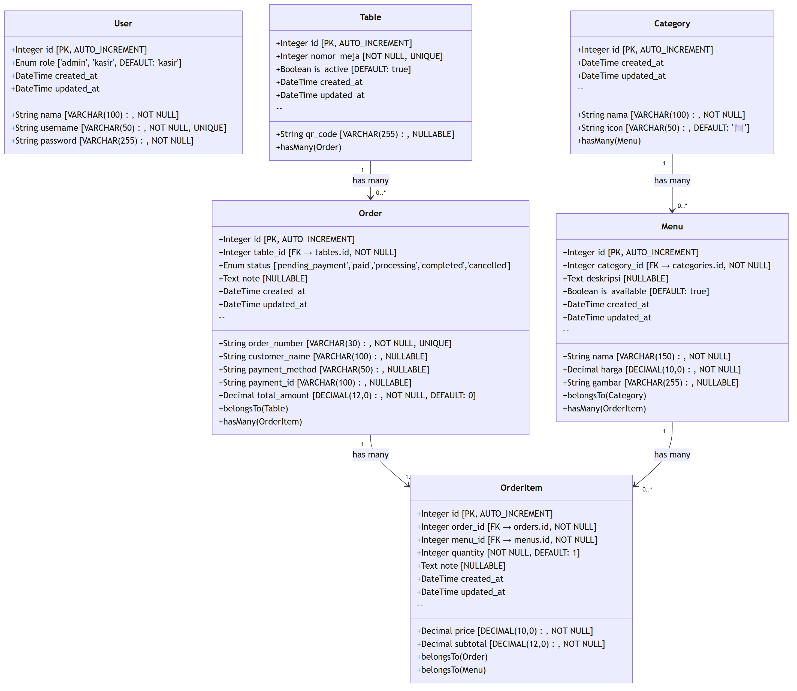
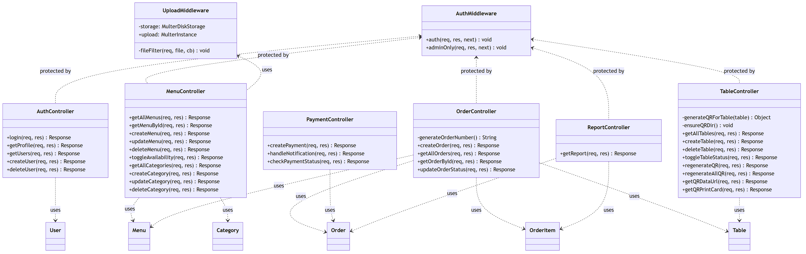
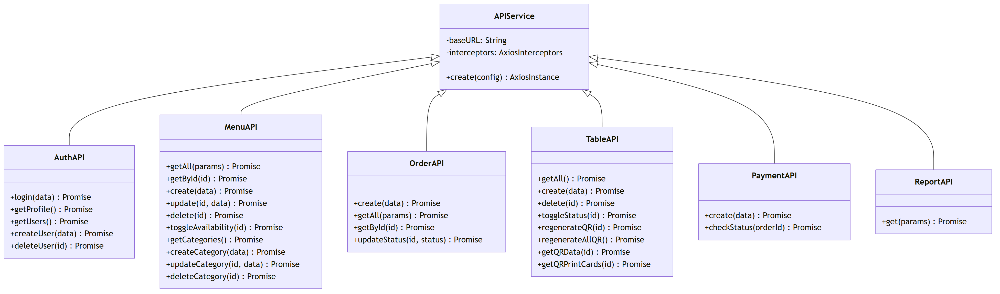
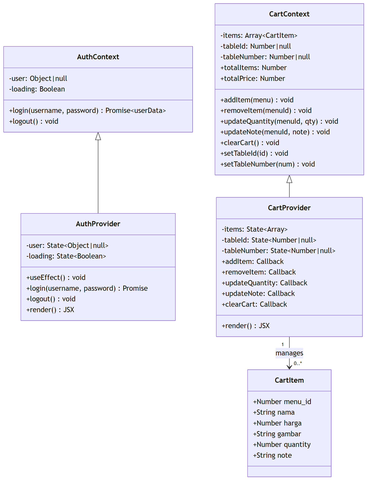
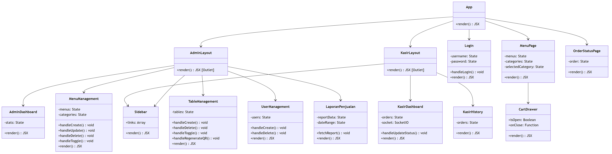
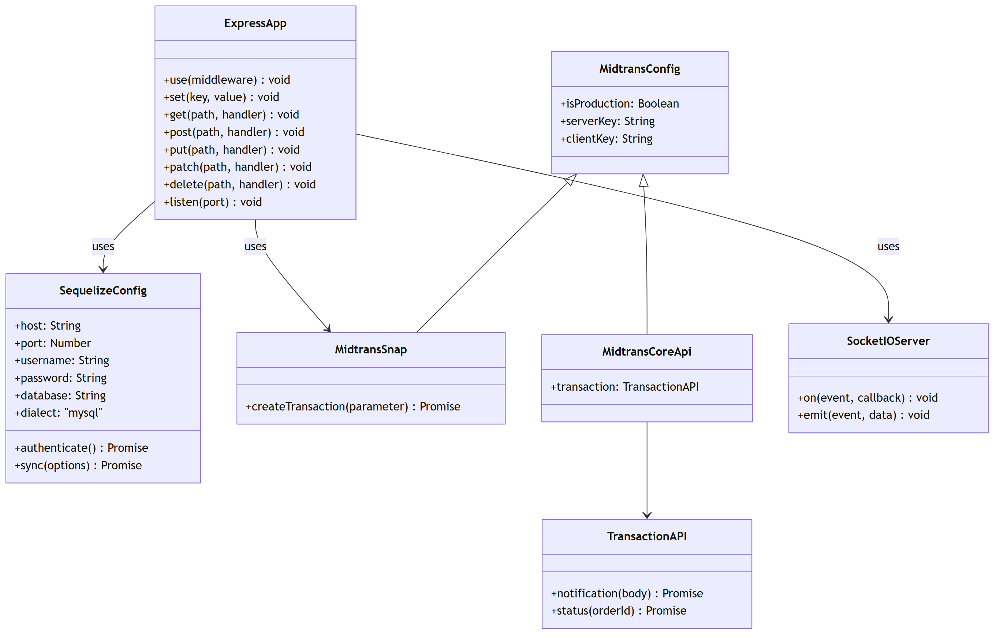

# E. Class Diagram

## Sistem Pemesanan Menu Kafe Ponbean Coffee

---

## 1. Class Diagram — Model Data (Backend)

---

## 2. Class Diagram — Controller Layer (Backend)

---

## 3. Class Diagram — Service Layer (Frontend React)

---

## 4. Class Diagram — React Context (State Management)

---

## 5. Class Diagram — React Components (Halaman)

---

## 6. Class Diagram — Konfigurasi & External Services

