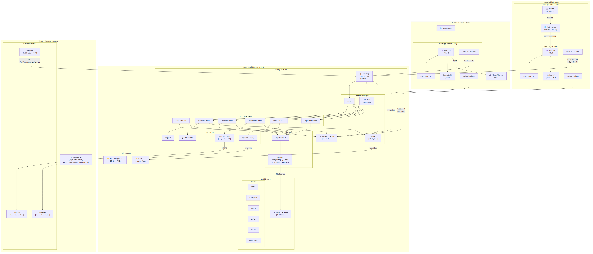
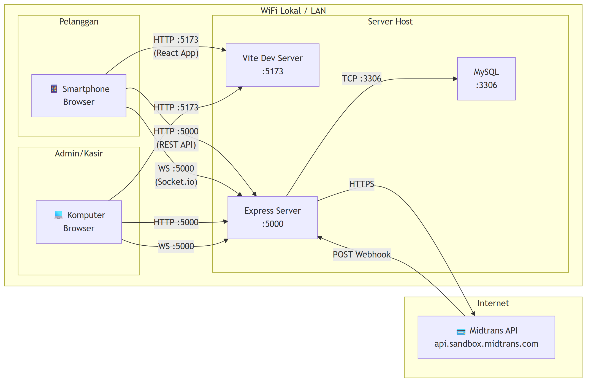
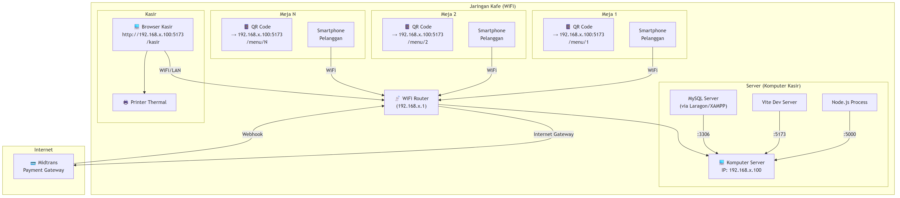
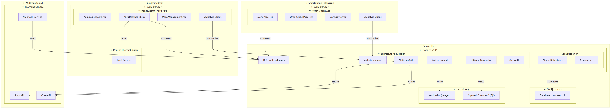

# F. Deployment Diagram

## Sistem Pemesanan Menu Kafe Ponbean Coffee

---

## 1. Deployment Diagram — Arsitektur Sistem

---

## 2. Deployment Diagram — Komunikasi Jaringan

---

## 3. Deployment Diagram — Komponen & Port

### Tabel Konfigurasi Deployment

| Komponen | Teknologi | Port Default | Protokol | Keterangan |
|----------|-----------|:---:|----------|------------|
| **Frontend (Client)** | React 19 + Vite 8 | `5173` | HTTP | Dev server, akses dari browser |
| **Backend (Server)** | Express.js + Socket.io | `5000` | HTTP + WS | REST API + WebSocket |
| **Database** | MySQL | `3306` | TCP | Sequelize ORM connection |
| **Midtrans Sandbox** | External API | `443` | HTTPS | Payment gateway |
| **File Upload** | Local filesystem | - | - | `/server/uploads/` |
| **QR Code Files** | Local filesystem | - | - | `/server/uploads/qrcodes/` |

### Environment Variables

| Variable | Komponen | Contoh Nilai |
|----------|----------|-------------|
| `PORT` | Server | `5000` |
| `DB_HOST` | Database | `localhost` |
| `DB_PORT` | Database | `3306` |
| `DB_USER` | Database | `root` |
| `DB_PASS` | Database | *(kosong)* |
| `DB_NAME` | Database | `ponbean_db` |
| `JWT_SECRET` | Auth | `your_jwt_secret_here` |
| `JWT_EXPIRES_IN` | Auth | `7d` |
| `MIDTRANS_SERVER_KEY` | Payment | `SB-Mid-server-xxx` |
| `MIDTRANS_CLIENT_KEY` | Payment | `SB-Mid-client-xxx` |
| `MIDTRANS_IS_PRODUCTION` | Payment | `false` |
| `CLIENT_URL` | CORS/QR | `http://localhost:5173` |

---

## 3. Deployment Diagram — Arsitektur Jaringan Lokal (Kafe)

---

## 4. Deployment Diagram — Node Deployment (UML Style)

