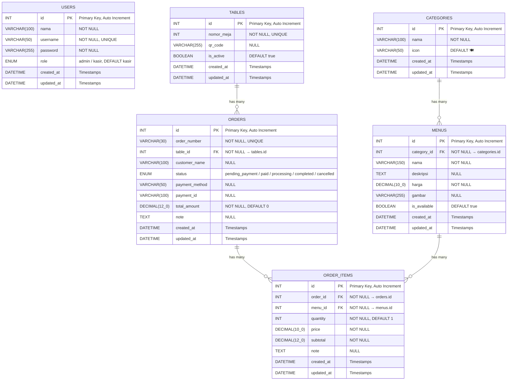

# G. Entity Relationship Diagram (ERD)

## Penjelasan

Entity Relationship Diagram (ERD) menggambarkan hubungan antar entitas dalam database **ponbean_db** yang digunakan pada Aplikasi Order Menu Ponbean. Database ini menggunakan MySQL melalui Sequelize ORM dan terdiri atas 6 tabel utama.

## Diagram ERD

## Keterangan Relasi

| No | Relasi | Tipe | Keterangan |
|----|--------|------|------------|
| 1 | CATEGORIES → MENUS | One to Many | Satu kategori memiliki banyak menu |
| 2 | TABLES → ORDERS | One to Many | Satu meja memiliki banyak pesanan |
| 3 | ORDERS → ORDER_ITEMS | One to Many | Satu pesanan memiliki banyak item |
| 4 | MENUS → ORDER_ITEMS | One to Many | Satu menu dapat muncul di banyak item pesanan |

> [!NOTE]
> Tabel `USERS` berdiri sendiri (tidak memiliki relasi foreign key ke tabel lain) karena berfungsi sebagai tabel autentikasi untuk admin dan kasir.
