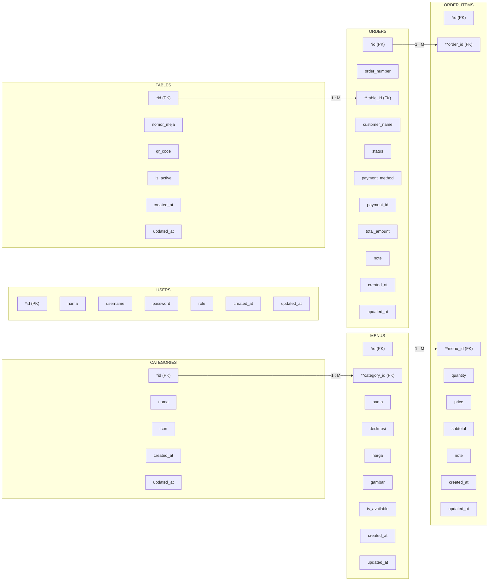

# H. Logical Record Structure (LRS)

## Penjelasan

Logical Record Structure (LRS) merupakan representasi dari struktur record-record pada tabel-tabel yang terbentuk dari hasil relasi antar himpunan entitas pada ERD. LRS menunjukkan tipe data, kunci, dan hubungan antar tabel secara lebih teknis.

Database yang digunakan adalah **ponbean_db** dengan software MySQL melalui Sequelize ORM.

## Diagram LRS

## Keterangan Simbol

| Simbol | Arti |
|--------|------|
| `*` (satu bintang) | Primary Key |
| `**` (dua bintang) | Foreign Key |
| `1 : M` | Relasi One to Many |

## Daftar Tabel dan Jumlah Field

| No | Nama Tabel | Jumlah Field | Keterangan |
|----|------------|--------------|------------|
| 1 | users | 7 | Tabel data pengguna (admin & kasir) |
| 2 | categories | 5 | Tabel kategori menu |
| 3 | menus | 9 | Tabel daftar menu makanan & minuman |
| 4 | tables | 6 | Tabel data meja restoran |
| 5 | orders | 11 | Tabel data pesanan |
| 6 | order_items | 9 | Tabel detail item pesanan |
